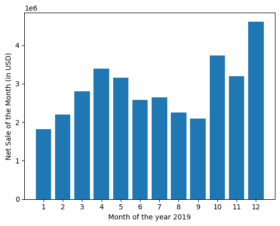
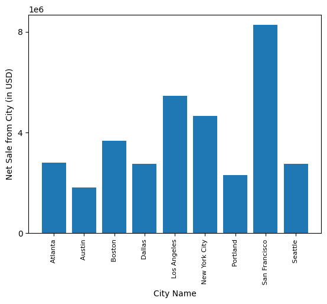
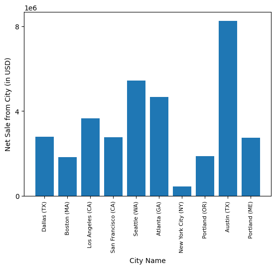
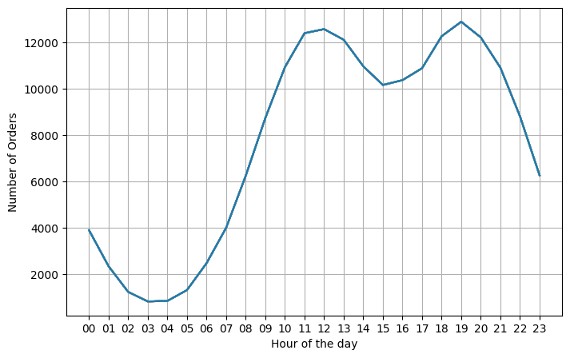
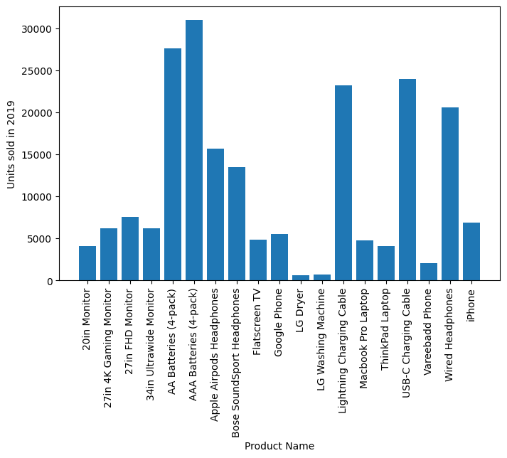
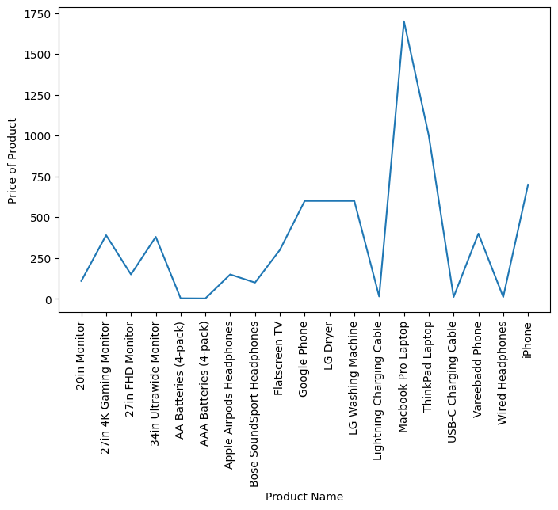
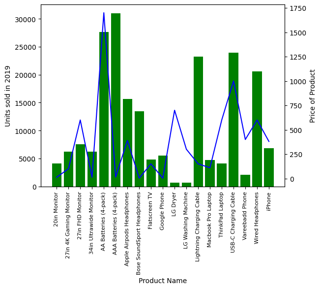

```python
import pandas as pd
import matplotlib.pyplot as plt
```


```python
data1=pd.read_csv(r"C:\Users\Vatsal_Fast\Desktop\DataSciencePractice\keithgaliElectronicRetailAnalysis\data\Sales_December_2019.csv")
data1
```


<div>
<style scoped>
    .dataframe tbody tr th:only-of-type {
        vertical-align: middle;
    }

    .dataframe tbody tr th {
        vertical-align: top;
    }

    .dataframe thead th {
        text-align: right;
    }
</style>
<table border="1" class="dataframe">
  <thead>
    <tr style="text-align: right;">
      <th></th>
      <th>Order ID</th>
      <th>Product</th>
      <th>Quantity Ordered</th>
      <th>Price Each</th>
      <th>Order Date</th>
      <th>Purchase Address</th>
    </tr>
  </thead>
  <tbody>
    <tr>
      <th>0</th>
      <td>295665</td>
      <td>Macbook Pro Laptop</td>
      <td>1</td>
      <td>1700</td>
      <td>12/30/19 00:01</td>
      <td>136 Church St, New York City, NY 10001</td>
    </tr>
    <tr>
      <th>1</th>
      <td>295666</td>
      <td>LG Washing Machine</td>
      <td>1</td>
      <td>600.0</td>
      <td>12/29/19 07:03</td>
      <td>562 2nd St, New York City, NY 10001</td>
    </tr>
    <tr>
      <th>2</th>
      <td>295667</td>
      <td>USB-C Charging Cable</td>
      <td>1</td>
      <td>11.95</td>
      <td>12/12/19 18:21</td>
      <td>277 Main St, New York City, NY 10001</td>
    </tr>
    <tr>
      <th>3</th>
      <td>295668</td>
      <td>27in FHD Monitor</td>
      <td>1</td>
      <td>149.99</td>
      <td>12/22/19 15:13</td>
      <td>410 6th St, San Francisco, CA 94016</td>
    </tr>
    <tr>
      <th>4</th>
      <td>295669</td>
      <td>USB-C Charging Cable</td>
      <td>1</td>
      <td>11.95</td>
      <td>12/18/19 12:38</td>
      <td>43 Hill St, Atlanta, GA 30301</td>
    </tr>
    <tr>
      <th>...</th>
      <td>...</td>
      <td>...</td>
      <td>...</td>
      <td>...</td>
      <td>...</td>
      <td>...</td>
    </tr>
    <tr>
      <th>25112</th>
      <td>319666</td>
      <td>Lightning Charging Cable</td>
      <td>1</td>
      <td>14.95</td>
      <td>12/11/19 20:58</td>
      <td>14 Madison St, San Francisco, CA 94016</td>
    </tr>
    <tr>
      <th>25113</th>
      <td>319667</td>
      <td>AA Batteries (4-pack)</td>
      <td>2</td>
      <td>3.84</td>
      <td>12/01/19 12:01</td>
      <td>549 Willow St, Los Angeles, CA 90001</td>
    </tr>
    <tr>
      <th>25114</th>
      <td>319668</td>
      <td>Vareebadd Phone</td>
      <td>1</td>
      <td>400</td>
      <td>12/09/19 06:43</td>
      <td>273 Wilson St, Seattle, WA 98101</td>
    </tr>
    <tr>
      <th>25115</th>
      <td>319669</td>
      <td>Wired Headphones</td>
      <td>1</td>
      <td>11.99</td>
      <td>12/03/19 10:39</td>
      <td>778 River St, Dallas, TX 75001</td>
    </tr>
    <tr>
      <th>25116</th>
      <td>319670</td>
      <td>Bose SoundSport Headphones</td>
      <td>1</td>
      <td>99.99</td>
      <td>12/21/19 21:45</td>
      <td>747 Chestnut St, Los Angeles, CA 90001</td>
    </tr>
  </tbody>
</table>
<p>25117 rows × 6 columns</p>
</div>


```python
import os

#for loop that could create a list by iterating over the directory file list
files=[file for file in os.listdir(r"C:\Users\Vatsal_Fast\Desktop\DataSciencePractice\keithgaliElectronicRetailAnalysis\data")]
files
```


    ['Sales_April_2019.csv',
     'Sales_August_2019.csv',
     'Sales_December_2019.csv',
     'Sales_February_2019.csv',
     'Sales_January_2019.csv',
     'Sales_July_2019.csv',
     'Sales_June_2019.csv',
     'Sales_March_2019.csv',
     'Sales_May_2019.csv',
     'Sales_November_2019.csv',
     'Sales_October_2019.csv',
     'Sales_September_2019.csv']


```python
year_data=pd.DataFrame()

for file in files:
#     month_data=pd.read_csv(r"H:\IT Cources\Data_science\keithgaillypython\Pandas\analysis\data\"+file)
    month_data=pd.read_csv("C:\\Users\\Vatsal_Fast\\Desktop\\DataSciencePractice\\keithgaliElectronicRetailAnalysis\\data\\"+file)
#     year_data=pd.concat[year_data,month_data]
    year_data=pd.concat([year_data,month_data])

    
# net records should be around 186850
print(year_data)
# year_data=pd.to_csv(r"H:\IT Cources\Data_science\keithgaillypython\Pandas\analysis\data\Sales_2019.csv")
year_data.to_csv(r"C:\Users\Vatsal_Fast\Desktop\DataSciencePractice\keithgaliElectronicRetailAnalysis\Agregateddata\Sales_2019.csv",index=False)
```

          Order ID                     Product Quantity Ordered Price Each  \
    0       176558        USB-C Charging Cable                2      11.95   
    1          NaN                         NaN              NaN        NaN   
    2       176559  Bose SoundSport Headphones                1      99.99   
    3       176560                Google Phone                1        600   
    4       176560            Wired Headphones                1      11.99   
    ...        ...                         ...              ...        ...   
    11681   259353      AAA Batteries (4-pack)                3       2.99   
    11682   259354                      iPhone                1        700   
    11683   259355                      iPhone                1        700   
    11684   259356      34in Ultrawide Monitor                1     379.99   
    11685   259357        USB-C Charging Cable                1      11.95   
    
               Order Date                         Purchase Address  
    0      04/19/19 08:46             917 1st St, Dallas, TX 75001  
    1                 NaN                                      NaN  
    2      04/07/19 22:30        682 Chestnut St, Boston, MA 02215  
    3      04/12/19 14:38     669 Spruce St, Los Angeles, CA 90001  
    4      04/12/19 14:38     669 Spruce St, Los Angeles, CA 90001  
    ...               ...                                      ...  
    11681  09/17/19 20:56   840 Highland St, Los Angeles, CA 90001  
    11682  09/01/19 16:00  216 Dogwood St, San Francisco, CA 94016  
    11683  09/23/19 07:39     220 12th St, San Francisco, CA 94016  
    11684  09/19/19 17:30   511 Forest St, San Francisco, CA 94016  
    11685  09/30/19 00:18   250 Meadow St, San Francisco, CA 94016  
    
    [186850 rows x 6 columns]
    


```python
data=pd.read_csv(r"C:\Users\Vatsal_Fast\Desktop\DataSciencePractice\keithgaliElectronicRetailAnalysis\Agregateddata\Sales_2019.csv")
print(data.head())
```

      Order ID                     Product Quantity Ordered Price Each  \
    0   176558        USB-C Charging Cable                2      11.95   
    1      NaN                         NaN              NaN        NaN   
    2   176559  Bose SoundSport Headphones                1      99.99   
    3   176560                Google Phone                1        600   
    4   176560            Wired Headphones                1      11.99   
    
           Order Date                      Purchase Address  
    0  04/19/19 08:46          917 1st St, Dallas, TX 75001  
    1             NaN                                   NaN  
    2  04/07/19 22:30     682 Chestnut St, Boston, MA 02215  
    3  04/12/19 14:38  669 Spruce St, Los Angeles, CA 90001  
    4  04/12/19 14:38  669 Spruce St, Los Angeles, CA 90001  
    

# Finding the best month for sales


```python
data['Month']=data['Order Date'].str[0:2]
data.head()
```


<div>
<style scoped>
    .dataframe tbody tr th:only-of-type {
        vertical-align: middle;
    }

    .dataframe tbody tr th {
        vertical-align: top;
    }

    .dataframe thead th {
        text-align: right;
    }
</style>
<table border="1" class="dataframe">
  <thead>
    <tr style="text-align: right;">
      <th></th>
      <th>Order ID</th>
      <th>Product</th>
      <th>Quantity Ordered</th>
      <th>Price Each</th>
      <th>Order Date</th>
      <th>Purchase Address</th>
      <th>Month</th>
    </tr>
  </thead>
  <tbody>
    <tr>
      <th>0</th>
      <td>176558</td>
      <td>USB-C Charging Cable</td>
      <td>2</td>
      <td>11.95</td>
      <td>04/19/19 08:46</td>
      <td>917 1st St, Dallas, TX 75001</td>
      <td>04</td>
    </tr>
    <tr>
      <th>1</th>
      <td>NaN</td>
      <td>NaN</td>
      <td>NaN</td>
      <td>NaN</td>
      <td>NaN</td>
      <td>NaN</td>
      <td>NaN</td>
    </tr>
    <tr>
      <th>2</th>
      <td>176559</td>
      <td>Bose SoundSport Headphones</td>
      <td>1</td>
      <td>99.99</td>
      <td>04/07/19 22:30</td>
      <td>682 Chestnut St, Boston, MA 02215</td>
      <td>04</td>
    </tr>
    <tr>
      <th>3</th>
      <td>176560</td>
      <td>Google Phone</td>
      <td>1</td>
      <td>600</td>
      <td>04/12/19 14:38</td>
      <td>669 Spruce St, Los Angeles, CA 90001</td>
      <td>04</td>
    </tr>
    <tr>
      <th>4</th>
      <td>176560</td>
      <td>Wired Headphones</td>
      <td>1</td>
      <td>11.99</td>
      <td>04/12/19 14:38</td>
      <td>669 Spruce St, Los Angeles, CA 90001</td>
      <td>04</td>
    </tr>
  </tbody>
</table>
</div>


```python
# data['Month']=data['Month'].astypr('int16')    
#error hence data cleaning
```


```python
# print(data[data['Month']=='NaN'])??????????????????????????

data=data.dropna(how='all')
data.head()

```


<div>
<style scoped>
    .dataframe tbody tr th:only-of-type {
        vertical-align: middle;
    }

    .dataframe tbody tr th {
        vertical-align: top;
    }

    .dataframe thead th {
        text-align: right;
    }
</style>
<table border="1" class="dataframe">
  <thead>
    <tr style="text-align: right;">
      <th></th>
      <th>Order ID</th>
      <th>Product</th>
      <th>Quantity Ordered</th>
      <th>Price Each</th>
      <th>Order Date</th>
      <th>Purchase Address</th>
      <th>Month</th>
    </tr>
  </thead>
  <tbody>
    <tr>
      <th>0</th>
      <td>176558</td>
      <td>USB-C Charging Cable</td>
      <td>2</td>
      <td>11.95</td>
      <td>04/19/19 08:46</td>
      <td>917 1st St, Dallas, TX 75001</td>
      <td>04</td>
    </tr>
    <tr>
      <th>2</th>
      <td>176559</td>
      <td>Bose SoundSport Headphones</td>
      <td>1</td>
      <td>99.99</td>
      <td>04/07/19 22:30</td>
      <td>682 Chestnut St, Boston, MA 02215</td>
      <td>04</td>
    </tr>
    <tr>
      <th>3</th>
      <td>176560</td>
      <td>Google Phone</td>
      <td>1</td>
      <td>600</td>
      <td>04/12/19 14:38</td>
      <td>669 Spruce St, Los Angeles, CA 90001</td>
      <td>04</td>
    </tr>
    <tr>
      <th>4</th>
      <td>176560</td>
      <td>Wired Headphones</td>
      <td>1</td>
      <td>11.99</td>
      <td>04/12/19 14:38</td>
      <td>669 Spruce St, Los Angeles, CA 90001</td>
      <td>04</td>
    </tr>
    <tr>
      <th>5</th>
      <td>176561</td>
      <td>Wired Headphones</td>
      <td>1</td>
      <td>11.99</td>
      <td>04/30/19 09:27</td>
      <td>333 8th St, Los Angeles, CA 90001</td>
      <td>04</td>
    </tr>
  </tbody>
</table>
</div>


```python
# data['Month']=data['Month'].astype('int16')
#further cleaning required
```


```python
print(data[data['Month']=='Or'])
data=data[data['Month']!='Or']
print(data[data['Month']=='Or'])
```

            Order ID  Product  Quantity Ordered  Price Each  Order Date  \
    519     Order ID  Product  Quantity Ordered  Price Each  Order Date   
    1149    Order ID  Product  Quantity Ordered  Price Each  Order Date   
    1155    Order ID  Product  Quantity Ordered  Price Each  Order Date   
    2878    Order ID  Product  Quantity Ordered  Price Each  Order Date   
    2893    Order ID  Product  Quantity Ordered  Price Each  Order Date   
    ...          ...      ...               ...         ...         ...   
    185164  Order ID  Product  Quantity Ordered  Price Each  Order Date   
    185551  Order ID  Product  Quantity Ordered  Price Each  Order Date   
    186563  Order ID  Product  Quantity Ordered  Price Each  Order Date   
    186632  Order ID  Product  Quantity Ordered  Price Each  Order Date   
    186738  Order ID  Product  Quantity Ordered  Price Each  Order Date   
    
            Purchase Address Month  
    519     Purchase Address    Or  
    1149    Purchase Address    Or  
    1155    Purchase Address    Or  
    2878    Purchase Address    Or  
    2893    Purchase Address    Or  
    ...                  ...   ...  
    185164  Purchase Address    Or  
    185551  Purchase Address    Or  
    186563  Purchase Address    Or  
    186632  Purchase Address    Or  
    186738  Purchase Address    Or  
    
    [355 rows x 7 columns]
    Empty DataFrame
    Columns: [Order ID, Product, Quantity Ordered, Price Each, Order Date, Purchase Address, Month]
    Index: []
    


```python
data['Month']=data['Month'].astype('int16')
print(data.head())
#success finally
```

      Order ID                     Product Quantity Ordered Price Each  \
    0   176558        USB-C Charging Cable                2      11.95   
    2   176559  Bose SoundSport Headphones                1      99.99   
    3   176560                Google Phone                1        600   
    4   176560            Wired Headphones                1      11.99   
    5   176561            Wired Headphones                1      11.99   
    
           Order Date                      Purchase Address  Month  
    0  04/19/19 08:46          917 1st St, Dallas, TX 75001      4  
    2  04/07/19 22:30     682 Chestnut St, Boston, MA 02215      4  
    3  04/12/19 14:38  669 Spruce St, Los Angeles, CA 90001      4  
    4  04/12/19 14:38  669 Spruce St, Los Angeles, CA 90001      4  
    5  04/30/19 09:27     333 8th St, Los Angeles, CA 90001      4  
    


```python
data['Net_price']=data['Quantity Ordered']*data['Price Each']
#further data cleaning required
```


    ---------------------------------------------------------------------------

    TypeError                                 Traceback (most recent call last)

    File ~\AppData\Local\Programs\Python\Python311\Lib\site-packages\pandas\core\ops\array_ops.py:171, in _na_arithmetic_op(left, right, op, is_cmp)
        170 try:
    --> 171     result = func(left, right)
        172 except TypeError:
    

    File ~\AppData\Local\Programs\Python\Python311\Lib\site-packages\pandas\core\computation\expressions.py:239, in evaluate(op, a, b, use_numexpr)
        237     if use_numexpr:
        238         # error: "None" not callable
    --> 239         return _evaluate(op, op_str, a, b)  # type: ignore[misc]
        240 return _evaluate_standard(op, op_str, a, b)
    

    File ~\AppData\Local\Programs\Python\Python311\Lib\site-packages\pandas\core\computation\expressions.py:70, in _evaluate_standard(op, op_str, a, b)
         69     _store_test_result(False)
    ---> 70 return op(a, b)
    

    TypeError: can't multiply sequence by non-int of type 'str'

    
    During handling of the above exception, another exception occurred:
    

    TypeError                                 Traceback (most recent call last)

    Cell In[13], line 1
    ----> 1 data['Net_price']=data['Quantity Ordered']*data['Price Each']
          2 #further data cleaning required
    

    File ~\AppData\Local\Programs\Python\Python311\Lib\site-packages\pandas\core\ops\common.py:81, in _unpack_zerodim_and_defer.<locals>.new_method(self, other)
         77             return NotImplemented
         79 other = item_from_zerodim(other)
    ---> 81 return method(self, other)
    

    File ~\AppData\Local\Programs\Python\Python311\Lib\site-packages\pandas\core\arraylike.py:202, in OpsMixin.__mul__(self, other)
        200 @unpack_zerodim_and_defer("__mul__")
        201 def __mul__(self, other):
    --> 202     return self._arith_method(other, operator.mul)
    

    File ~\AppData\Local\Programs\Python\Python311\Lib\site-packages\pandas\core\series.py:6112, in Series._arith_method(self, other, op)
       6110 def _arith_method(self, other, op):
       6111     self, other = ops.align_method_SERIES(self, other)
    -> 6112     return base.IndexOpsMixin._arith_method(self, other, op)
    

    File ~\AppData\Local\Programs\Python\Python311\Lib\site-packages\pandas\core\base.py:1348, in IndexOpsMixin._arith_method(self, other, op)
       1345 rvalues = ensure_wrapped_if_datetimelike(rvalues)
       1347 with np.errstate(all="ignore"):
    -> 1348     result = ops.arithmetic_op(lvalues, rvalues, op)
       1350 return self._construct_result(result, name=res_name)
    

    File ~\AppData\Local\Programs\Python\Python311\Lib\site-packages\pandas\core\ops\array_ops.py:232, in arithmetic_op(left, right, op)
        228     _bool_arith_check(op, left, right)
        230     # error: Argument 1 to "_na_arithmetic_op" has incompatible type
        231     # "Union[ExtensionArray, ndarray[Any, Any]]"; expected "ndarray[Any, Any]"
    --> 232     res_values = _na_arithmetic_op(left, right, op)  # type: ignore[arg-type]
        234 return res_values
    

    File ~\AppData\Local\Programs\Python\Python311\Lib\site-packages\pandas\core\ops\array_ops.py:178, in _na_arithmetic_op(left, right, op, is_cmp)
        172 except TypeError:
        173     if not is_cmp and (is_object_dtype(left.dtype) or is_object_dtype(right)):
        174         # For object dtype, fallback to a masked operation (only operating
        175         #  on the non-missing values)
        176         # Don't do this for comparisons, as that will handle complex numbers
        177         #  incorrectly, see GH#32047
    --> 178         result = _masked_arith_op(left, right, op)
        179     else:
        180         raise
    

    File ~\AppData\Local\Programs\Python\Python311\Lib\site-packages\pandas\core\ops\array_ops.py:116, in _masked_arith_op(x, y, op)
        114     # See GH#5284, GH#5035, GH#19448 for historical reference
        115     if mask.any():
    --> 116         result[mask] = op(xrav[mask], yrav[mask])
        118 else:
        119     if not is_scalar(y):
    

    TypeError: can't multiply sequence by non-int of type 'str'


```python
# data['Quantity Ordered']=data['Quantity Ordered'].astype('int32')
# data['Price Each']=data['Price Each'].astype('float')

#or

data['Quantity Ordered']=pd.to_numeric(data['Quantity Ordered'])
data['Price Each']=pd.to_numeric(data['Price Each'])
```


```python
data['Net_price']=data['Quantity Ordered']*data['Price Each']
print(data.head())

print(data.groupby('Month').sum().sort_values(by=['Net_price'],ascending=False))

```

      Order ID                     Product  Quantity Ordered  Price Each  \
    0   176558        USB-C Charging Cable                 2       11.95   
    2   176559  Bose SoundSport Headphones                 1       99.99   
    3   176560                Google Phone                 1      600.00   
    4   176560            Wired Headphones                 1       11.99   
    5   176561            Wired Headphones                 1       11.99   
    
           Order Date                      Purchase Address  Month  Net_price  
    0  04/19/19 08:46          917 1st St, Dallas, TX 75001      4      23.90  
    2  04/07/19 22:30     682 Chestnut St, Boston, MA 02215      4      99.99  
    3  04/12/19 14:38  669 Spruce St, Los Angeles, CA 90001      4     600.00  
    4  04/12/19 14:38  669 Spruce St, Los Angeles, CA 90001      4      11.99  
    5  04/30/19 09:27     333 8th St, Los Angeles, CA 90001      4      11.99  
                                                    Order ID  \
    Month                                                      
    12     2956652956662956672956682956692956702956712956...   
    10     2593582593592593602593612593622593632593642593...   
    4      1765581765591765601765601765611765621765631765...   
    11     2787972787982787992788002788012788022788032788...   
    5      1769781775511777781777781790761790761791341800...   
    3      1505331505411508121517491520361532841535441538...   
    7      2229102229112229122229132229142229152229162229...   
    6      2099212099222099232099242099252099262099272099...   
    8      2366702366712366722366732366742366752366762366...   
    2      1505021505031505041505051505061505071505081505...   
    9      2388342392852406362410542423432428652436672449...   
    1      2971502978172978172979692983442990492991253003...   
    
                                                     Product  Quantity Ordered  \
    Month                                                                        
    12     Macbook Pro LaptopLG Washing MachineUSB-C Char...             28114   
    10     34in Ultrawide Monitor27in 4K Gaming MonitorAA...             22703   
    4      USB-C Charging CableBose SoundSport Headphones...             20558   
    11     Wired HeadphonesUSB-C Charging CableApple Airp...             19798   
    5      Apple Airpods Headphones27in FHD MonitoriPhone...             18667   
    3      AAA Batteries (4-pack)AAA Batteries (4-pack)Wi...             17005   
    7      Apple Airpods HeadphonesFlatscreen TVAA Batter...             16072   
    6      USB-C Charging CableMacbook Pro LaptopThinkPad...             15253   
    8      Wired HeadphonesBose SoundSport HeadphonesiPho...             13448   
    2      iPhoneAA Batteries (4-pack)27in 4K Gaming Moni...             13449   
    9      Apple Airpods Headphones34in Ultrawide Monitor...             13109   
    1      Lightning Charging CableiPhoneLightning Chargi...             10903   
    
           Price Each                                         Order Date  \
    Month                                                                  
    12     4588415.41  12/30/19 00:0112/29/19 07:0312/12/19 18:2112/2...   
    10     3715554.83  10/28/19 10:5610/28/19 17:2610/24/19 17:2010/1...   
    4      3367671.02  04/19/19 08:4604/07/19 22:3004/12/19 14:3804/1...   
    11     3180600.68  11/21/19 09:5411/17/19 10:0311/19/19 14:5611/2...   
    5      3135125.13  05/01/19 03:2905/01/19 00:1305/01/19 00:4805/0...   
    3      2791207.83  03/01/19 03:0603/01/19 01:0303/01/19 02:1803/0...   
    7      2632539.56  07/26/19 16:5107/05/19 08:5507/29/19 12:4107/2...   
    6      2562025.61  06/23/19 19:3406/30/19 10:0506/24/19 20:1806/0...   
    8      2230345.42  08/31/19 22:2108/15/19 15:1108/06/19 14:4008/2...   
    2      2188884.72  02/18/19 01:3502/13/19 07:2402/18/19 09:4602/0...   
    9      2084992.09  09/01/19 04:1309/01/19 01:0909/01/19 02:0709/0...   
    1      1811768.38  01/01/20 00:3801/01/20 00:2201/01/20 00:2201/0...   
    
                                            Purchase Address   Net_price  
    Month                                                                 
    12     136 Church St, New York City, NY 10001562 2nd ...  4613443.34  
    10     609 Cherry St, Dallas, TX 75001225 5th St, Los...  3736726.88  
    4      917 1st St, Dallas, TX 75001682 Chestnut St, B...  3390670.24  
    11     46 Park St, New York City, NY 10001962 Hickory...  3199603.20  
    5      589 Lake St, Portland, OR 97035615 Lincoln St,...  3152606.75  
    3      270 Dogwood St, San Francisco, CA 94016683 Ada...  2807100.38  
    7      389 South St, Atlanta, GA 30301590 4th St, Sea...  2647775.76  
    6      950 Walnut St, Portland, ME 0410180 4th St, Sa...  2577802.26  
    8      359 Spruce St, Seattle, WA 98101492 Ridge St, ...  2244467.88  
    2      866 Spruce St, Portland, ME 0410118 13th St, S...  2202022.42  
    9      761 Forest St, San Francisco, CA 94016373 1st ...  2097560.13  
    1      427 Wilson St, Dallas, TX 75001519 13th St, Ne...  1822256.73  
    


```python

monthly_sale=data.groupby('Month').sum()['Net_price']

# months=arange(1,13)
months=range(1,13)
print(months)

plt.xlabel('Month of the year 2019')
plt.ylabel('Net Sale of the Month (in USD)')
plt.xticks(months)

plt.bar(months,monthly_sale)

plt.show()
```

    range(1, 13)
    


    

    


# Finding the City with Highest Sale


```python
data

# data['Purchase Address'].apply(lambda x: x.split(','))[1]
data['Purchase Address'].apply(lambda x: x.split(',')[1])

data['City']=data['Purchase Address'].apply(lambda x: x.split(',')[1])


print(data)
```

           Order ID                     Product  Quantity Ordered  Price Each  \
    0        176558        USB-C Charging Cable                 2       11.95   
    2        176559  Bose SoundSport Headphones                 1       99.99   
    3        176560                Google Phone                 1      600.00   
    4        176560            Wired Headphones                 1       11.99   
    5        176561            Wired Headphones                 1       11.99   
    ...         ...                         ...               ...         ...   
    186845   259353      AAA Batteries (4-pack)                 3        2.99   
    186846   259354                      iPhone                 1      700.00   
    186847   259355                      iPhone                 1      700.00   
    186848   259356      34in Ultrawide Monitor                 1      379.99   
    186849   259357        USB-C Charging Cable                 1       11.95   
    
                Order Date                         Purchase Address  Month  \
    0       04/19/19 08:46             917 1st St, Dallas, TX 75001      4   
    2       04/07/19 22:30        682 Chestnut St, Boston, MA 02215      4   
    3       04/12/19 14:38     669 Spruce St, Los Angeles, CA 90001      4   
    4       04/12/19 14:38     669 Spruce St, Los Angeles, CA 90001      4   
    5       04/30/19 09:27        333 8th St, Los Angeles, CA 90001      4   
    ...                ...                                      ...    ...   
    186845  09/17/19 20:56   840 Highland St, Los Angeles, CA 90001      9   
    186846  09/01/19 16:00  216 Dogwood St, San Francisco, CA 94016      9   
    186847  09/23/19 07:39     220 12th St, San Francisco, CA 94016      9   
    186848  09/19/19 17:30   511 Forest St, San Francisco, CA 94016      9   
    186849  09/30/19 00:18   250 Meadow St, San Francisco, CA 94016      9   
    
            Net_price            City  
    0           23.90          Dallas  
    2           99.99          Boston  
    3          600.00     Los Angeles  
    4           11.99     Los Angeles  
    5           11.99     Los Angeles  
    ...           ...             ...  
    186845       8.97     Los Angeles  
    186846     700.00   San Francisco  
    186847     700.00   San Francisco  
    186848     379.99   San Francisco  
    186849      11.95   San Francisco  
    
    [185950 rows x 9 columns]
    


```python
data.groupby('City').sum()

city_sale=data.groupby('City').sum()['Net_price']


# city=pd.distinct[data['City']] #no
# city=data['City'].unique()                                        #with chance of error
#or
# city=[city for city in data.groupby('City')] #no
city=[city for city,data in data.groupby('City')]


plt.xlabel('City Name')
plt.ylabel('Net Sale from City (in USD)')
# plt.xticks(city)??????????????????????????????????????????????????????????????????????????
plt.xticks(rotation='vertical',size=8)

# y=float(range(1,5))?????????????????????????????????????????????????????????????????????????????????
# yticks=y*0.4

plt.yticks([0,4000000,8000000,12000000,16000000])

plt.bar(city,city_sale)

plt.show()
data.groupby('City').sum()
```


    

    


<div>
<style scoped>
    .dataframe tbody tr th:only-of-type {
        vertical-align: middle;
    }

    .dataframe tbody tr th {
        vertical-align: top;
    }

    .dataframe thead th {
        text-align: right;
    }
</style>
<table border="1" class="dataframe">
  <thead>
    <tr style="text-align: right;">
      <th></th>
      <th>Order ID</th>
      <th>Product</th>
      <th>Quantity Ordered</th>
      <th>Price Each</th>
      <th>Order Date</th>
      <th>Purchase Address</th>
      <th>Month</th>
      <th>Net_price</th>
    </tr>
    <tr>
      <th>City</th>
      <th></th>
      <th></th>
      <th></th>
      <th></th>
      <th></th>
      <th></th>
      <th></th>
      <th></th>
    </tr>
  </thead>
  <tbody>
    <tr>
      <th>Atlanta</th>
      <td>1765641765711765821765891766231766271766341766...</td>
      <td>USB-C Charging CableLightning Charging CableBo...</td>
      <td>16602</td>
      <td>2779908.20</td>
      <td>04/12/19 10:5804/19/19 14:2904/27/19 12:2004/0...</td>
      <td>790 Ridge St, Atlanta, GA 30301253 Johnson St,...</td>
      <td>104794</td>
      <td>2795498.58</td>
    </tr>
    <tr>
      <th>Austin</th>
      <td>1765911766091766741766771766861767011767051767...</td>
      <td>Apple Airpods HeadphonesApple Airpods Headphon...</td>
      <td>11153</td>
      <td>1809873.61</td>
      <td>04/21/19 07:2104/11/19 16:5904/20/19 20:5304/0...</td>
      <td>600 Maple St, Austin, TX 73301267 11th St, Aus...</td>
      <td>69829</td>
      <td>1819581.75</td>
    </tr>
    <tr>
      <th>Boston</th>
      <td>1765591765661765781765811765851765851766001766...</td>
      <td>Bose SoundSport HeadphonesWired HeadphonesAppl...</td>
      <td>22528</td>
      <td>3637409.77</td>
      <td>04/07/19 22:3004/08/19 14:0504/09/19 23:3504/0...</td>
      <td>682 Chestnut St, Boston, MA 0221583 7th St, Bo...</td>
      <td>141112</td>
      <td>3661642.01</td>
    </tr>
    <tr>
      <th>Dallas</th>
      <td>1765581765691765701765771765961766021766101766...</td>
      <td>USB-C Charging Cable27in 4K Gaming MonitorAA B...</td>
      <td>16730</td>
      <td>2752627.82</td>
      <td>04/19/19 08:4604/16/19 19:2304/22/19 15:0904/0...</td>
      <td>917 1st St, Dallas, TX 75001657 Hill St, Dalla...</td>
      <td>104620</td>
      <td>2767975.40</td>
    </tr>
    <tr>
      <th>Los Angeles</th>
      <td>1765601765601765611765671765741765741765761765...</td>
      <td>Google PhoneWired HeadphonesWired HeadphonesGo...</td>
      <td>33289</td>
      <td>5421435.23</td>
      <td>04/12/19 14:3804/12/19 14:3804/30/19 09:2704/1...</td>
      <td>669 Spruce St, Los Angeles, CA 90001669 Spruce...</td>
      <td>208325</td>
      <td>5452570.80</td>
    </tr>
    <tr>
      <th>New York City</th>
      <td>1765721765751765791765901765991766131766371766...</td>
      <td>Apple Airpods HeadphonesAAA Batteries (4-pack)...</td>
      <td>27932</td>
      <td>4635370.83</td>
      <td>04/04/19 20:3004/27/19 00:3004/11/19 10:2304/1...</td>
      <td>149 Dogwood St, New York City, NY 10001433 Hil...</td>
      <td>175741</td>
      <td>4664317.43</td>
    </tr>
    <tr>
      <th>Portland</th>
      <td>1765831765931766171766421766461766481766621767...</td>
      <td>AAA Batteries (4-pack)Lightning Charging Cable...</td>
      <td>14053</td>
      <td>2307747.47</td>
      <td>04/20/19 12:0004/15/19 13:4504/25/19 08:0304/1...</td>
      <td>146 Jackson St, Portland, OR 97035906 7th St, ...</td>
      <td>87765</td>
      <td>2320490.61</td>
    </tr>
    <tr>
      <th>San Francisco</th>
      <td>1765621765651765731765841765861765861765941765...</td>
      <td>USB-C Charging CableMacbook Pro LaptopUSB-C Ch...</td>
      <td>50239</td>
      <td>8211461.74</td>
      <td>04/29/19 13:0304/24/19 10:3804/27/19 18:4104/2...</td>
      <td>381 Wilson St, San Francisco, CA 94016915 Will...</td>
      <td>315520</td>
      <td>8262203.91</td>
    </tr>
    <tr>
      <th>Seattle</th>
      <td>1765631765681765881766121766241766541766631766...</td>
      <td>Bose SoundSport HeadphonesLightning Charging C...</td>
      <td>16553</td>
      <td>2733296.01</td>
      <td>04/02/19 07:4604/15/19 12:1804/02/19 04:0004/0...</td>
      <td>668 Center St, Seattle, WA 98101438 Elm St, Se...</td>
      <td>104941</td>
      <td>2747755.48</td>
    </tr>
  </tbody>
</table>
</div>


```python
data['City'].unique()
```


    array([' Dallas', ' Boston', ' Los Angeles', ' San Francisco', ' Seattle',
           ' Atlanta', ' New York City', ' Portland', ' Austin'], dtype=object)


```python
#there could be multiple cities with same name hence state is also important

def getcity(x):
    return x.split(',')[1]

def getstate(x):
    y=x.split(',')[2]
    return y.split(' ')[1]

def getpin(x):
    y=x.split(',')[2]
    return y.split(' ')[2]

# data['CitywithState']=f"{getcity(data['Purchase Address'])} {getstate(data['Purchase Address'])}"
data['CitywithState']=data['Purchase Address'].apply(lambda x: f"{getcity(x)} ({getstate(x)})")

data['City Pin']=data['Purchase Address'].apply(lambda x: f"{getpin(x)}")

print(data)
data.groupby('CitywithState').sum()
# data.groupby('City').sum()
# data.groupby('City Pin').sum()
```

           Order ID                     Product  Quantity Ordered  Price Each  \
    0        176558        USB-C Charging Cable                 2       11.95   
    2        176559  Bose SoundSport Headphones                 1       99.99   
    3        176560                Google Phone                 1      600.00   
    4        176560            Wired Headphones                 1       11.99   
    5        176561            Wired Headphones                 1       11.99   
    ...         ...                         ...               ...         ...   
    186845   259353      AAA Batteries (4-pack)                 3        2.99   
    186846   259354                      iPhone                 1      700.00   
    186847   259355                      iPhone                 1      700.00   
    186848   259356      34in Ultrawide Monitor                 1      379.99   
    186849   259357        USB-C Charging Cable                 1       11.95   
    
                Order Date                         Purchase Address  Month  \
    0       04/19/19 08:46             917 1st St, Dallas, TX 75001      4   
    2       04/07/19 22:30        682 Chestnut St, Boston, MA 02215      4   
    3       04/12/19 14:38     669 Spruce St, Los Angeles, CA 90001      4   
    4       04/12/19 14:38     669 Spruce St, Los Angeles, CA 90001      4   
    5       04/30/19 09:27        333 8th St, Los Angeles, CA 90001      4   
    ...                ...                                      ...    ...   
    186845  09/17/19 20:56   840 Highland St, Los Angeles, CA 90001      9   
    186846  09/01/19 16:00  216 Dogwood St, San Francisco, CA 94016      9   
    186847  09/23/19 07:39     220 12th St, San Francisco, CA 94016      9   
    186848  09/19/19 17:30   511 Forest St, San Francisco, CA 94016      9   
    186849  09/30/19 00:18   250 Meadow St, San Francisco, CA 94016      9   
    
            Net_price            City        CitywithState City Pin  
    0           23.90          Dallas          Dallas (TX)    75001  
    2           99.99          Boston          Boston (MA)    02215  
    3          600.00     Los Angeles     Los Angeles (CA)    90001  
    4           11.99     Los Angeles     Los Angeles (CA)    90001  
    5           11.99     Los Angeles     Los Angeles (CA)    90001  
    ...           ...             ...                  ...      ...  
    186845       8.97     Los Angeles     Los Angeles (CA)    90001  
    186846     700.00   San Francisco   San Francisco (CA)    94016  
    186847     700.00   San Francisco   San Francisco (CA)    94016  
    186848     379.99   San Francisco   San Francisco (CA)    94016  
    186849      11.95   San Francisco   San Francisco (CA)    94016  
    
    [185950 rows x 11 columns]
    


<div>
<style scoped>
    .dataframe tbody tr th:only-of-type {
        vertical-align: middle;
    }

    .dataframe tbody tr th {
        vertical-align: top;
    }

    .dataframe thead th {
        text-align: right;
    }
</style>
<table border="1" class="dataframe">
  <thead>
    <tr style="text-align: right;">
      <th></th>
      <th>Order ID</th>
      <th>Product</th>
      <th>Quantity Ordered</th>
      <th>Price Each</th>
      <th>Order Date</th>
      <th>Purchase Address</th>
      <th>Month</th>
      <th>Net_price</th>
      <th>City</th>
      <th>City Pin</th>
    </tr>
    <tr>
      <th>CitywithState</th>
      <th></th>
      <th></th>
      <th></th>
      <th></th>
      <th></th>
      <th></th>
      <th></th>
      <th></th>
      <th></th>
      <th></th>
    </tr>
  </thead>
  <tbody>
    <tr>
      <th>Atlanta (GA)</th>
      <td>1765641765711765821765891766231766271766341766...</td>
      <td>USB-C Charging CableLightning Charging CableBo...</td>
      <td>16602</td>
      <td>2779908.20</td>
      <td>04/12/19 10:5804/19/19 14:2904/27/19 12:2004/0...</td>
      <td>790 Ridge St, Atlanta, GA 30301253 Johnson St,...</td>
      <td>104794</td>
      <td>2795498.58</td>
      <td>Atlanta Atlanta Atlanta Atlanta Atlanta Atlan...</td>
      <td>3030130301303013030130301303013030130301303013...</td>
    </tr>
    <tr>
      <th>Austin (TX)</th>
      <td>1765911766091766741766771766861767011767051767...</td>
      <td>Apple Airpods HeadphonesApple Airpods Headphon...</td>
      <td>11153</td>
      <td>1809873.61</td>
      <td>04/21/19 07:2104/11/19 16:5904/20/19 20:5304/0...</td>
      <td>600 Maple St, Austin, TX 73301267 11th St, Aus...</td>
      <td>69829</td>
      <td>1819581.75</td>
      <td>Austin Austin Austin Austin Austin Austin Aus...</td>
      <td>7330173301733017330173301733017330173301733017...</td>
    </tr>
    <tr>
      <th>Boston (MA)</th>
      <td>1765591765661765781765811765851765851766001766...</td>
      <td>Bose SoundSport HeadphonesWired HeadphonesAppl...</td>
      <td>22528</td>
      <td>3637409.77</td>
      <td>04/07/19 22:3004/08/19 14:0504/09/19 23:3504/0...</td>
      <td>682 Chestnut St, Boston, MA 0221583 7th St, Bo...</td>
      <td>141112</td>
      <td>3661642.01</td>
      <td>Boston Boston Boston Boston Boston Boston Bos...</td>
      <td>0221502215022150221502215022150221502215022150...</td>
    </tr>
    <tr>
      <th>Dallas (TX)</th>
      <td>1765581765691765701765771765961766021766101766...</td>
      <td>USB-C Charging Cable27in 4K Gaming MonitorAA B...</td>
      <td>16730</td>
      <td>2752627.82</td>
      <td>04/19/19 08:4604/16/19 19:2304/22/19 15:0904/0...</td>
      <td>917 1st St, Dallas, TX 75001657 Hill St, Dalla...</td>
      <td>104620</td>
      <td>2767975.40</td>
      <td>Dallas Dallas Dallas Dallas Dallas Dallas Dal...</td>
      <td>7500175001750017500175001750017500175001750017...</td>
    </tr>
    <tr>
      <th>Los Angeles (CA)</th>
      <td>1765601765601765611765671765741765741765761765...</td>
      <td>Google PhoneWired HeadphonesWired HeadphonesGo...</td>
      <td>33289</td>
      <td>5421435.23</td>
      <td>04/12/19 14:3804/12/19 14:3804/30/19 09:2704/1...</td>
      <td>669 Spruce St, Los Angeles, CA 90001669 Spruce...</td>
      <td>208325</td>
      <td>5452570.80</td>
      <td>Los Angeles Los Angeles Los Angeles Los Angel...</td>
      <td>9000190001900019000190001900019000190001900019...</td>
    </tr>
    <tr>
      <th>New York City (NY)</th>
      <td>1765721765751765791765901765991766131766371766...</td>
      <td>Apple Airpods HeadphonesAAA Batteries (4-pack)...</td>
      <td>27932</td>
      <td>4635370.83</td>
      <td>04/04/19 20:3004/27/19 00:3004/11/19 10:2304/1...</td>
      <td>149 Dogwood St, New York City, NY 10001433 Hil...</td>
      <td>175741</td>
      <td>4664317.43</td>
      <td>New York City New York City New York City New...</td>
      <td>1000110001100011000110001100011000110001100011...</td>
    </tr>
    <tr>
      <th>Portland (ME)</th>
      <td>1767731768791769091770721772301772331772991773...</td>
      <td>AAA Batteries (4-pack)Flatscreen TVWired Headp...</td>
      <td>2750</td>
      <td>447189.25</td>
      <td>04/25/19 20:0704/13/19 14:1504/22/19 09:5304/0...</td>
      <td>30 9th St, Portland, ME 04101370 Sunset St, Po...</td>
      <td>17144</td>
      <td>449758.27</td>
      <td>Portland Portland Portland Portland Portland ...</td>
      <td>0410104101041010410104101041010410104101041010...</td>
    </tr>
    <tr>
      <th>Portland (OR)</th>
      <td>1765831765931766171766421766461766481766621767...</td>
      <td>AAA Batteries (4-pack)Lightning Charging Cable...</td>
      <td>11303</td>
      <td>1860558.22</td>
      <td>04/20/19 12:0004/15/19 13:4504/25/19 08:0304/1...</td>
      <td>146 Jackson St, Portland, OR 97035906 7th St, ...</td>
      <td>70621</td>
      <td>1870732.34</td>
      <td>Portland Portland Portland Portland Portland ...</td>
      <td>9703597035970359703597035970359703597035970359...</td>
    </tr>
    <tr>
      <th>San Francisco (CA)</th>
      <td>1765621765651765731765841765861765861765941765...</td>
      <td>USB-C Charging CableMacbook Pro LaptopUSB-C Ch...</td>
      <td>50239</td>
      <td>8211461.74</td>
      <td>04/29/19 13:0304/24/19 10:3804/27/19 18:4104/2...</td>
      <td>381 Wilson St, San Francisco, CA 94016915 Will...</td>
      <td>315520</td>
      <td>8262203.91</td>
      <td>San Francisco San Francisco San Francisco San...</td>
      <td>9401694016940169401694016940169401694016940169...</td>
    </tr>
    <tr>
      <th>Seattle (WA)</th>
      <td>1765631765681765881766121766241766541766631766...</td>
      <td>Bose SoundSport HeadphonesLightning Charging C...</td>
      <td>16553</td>
      <td>2733296.01</td>
      <td>04/02/19 07:4604/15/19 12:1804/02/19 04:0004/0...</td>
      <td>668 Center St, Seattle, WA 98101438 Elm St, Se...</td>
      <td>104941</td>
      <td>2747755.48</td>
      <td>Seattle Seattle Seattle Seattle Seattle Seatt...</td>
      <td>9810198101981019810198101981019810198101981019...</td>
    </tr>
  </tbody>
</table>
</div>


```python
city_sale=data.groupby('CitywithState').sum()['Net_price']


city=data['CitywithState'].unique()                                        #with chance of error


plt.xlabel('City Name')
plt.ylabel('Net Sale from City (in USD)')
plt.xticks(rotation='vertical',size=8)

plt.yticks([0,4000000,8000000,12000000,16000000])

plt.bar(city,city_sale)

plt.show()
data.groupby('CitywithState').sum()
```


    

    


<div>
<style scoped>
    .dataframe tbody tr th:only-of-type {
        vertical-align: middle;
    }

    .dataframe tbody tr th {
        vertical-align: top;
    }

    .dataframe thead th {
        text-align: right;
    }
</style>
<table border="1" class="dataframe">
  <thead>
    <tr style="text-align: right;">
      <th></th>
      <th>Order ID</th>
      <th>Product</th>
      <th>Quantity Ordered</th>
      <th>Price Each</th>
      <th>Order Date</th>
      <th>Purchase Address</th>
      <th>Month</th>
      <th>Net_price</th>
      <th>City</th>
      <th>City Pin</th>
    </tr>
    <tr>
      <th>CitywithState</th>
      <th></th>
      <th></th>
      <th></th>
      <th></th>
      <th></th>
      <th></th>
      <th></th>
      <th></th>
      <th></th>
      <th></th>
    </tr>
  </thead>
  <tbody>
    <tr>
      <th>Atlanta (GA)</th>
      <td>1765641765711765821765891766231766271766341766...</td>
      <td>USB-C Charging CableLightning Charging CableBo...</td>
      <td>16602</td>
      <td>2779908.20</td>
      <td>04/12/19 10:5804/19/19 14:2904/27/19 12:2004/0...</td>
      <td>790 Ridge St, Atlanta, GA 30301253 Johnson St,...</td>
      <td>104794</td>
      <td>2795498.58</td>
      <td>Atlanta Atlanta Atlanta Atlanta Atlanta Atlan...</td>
      <td>3030130301303013030130301303013030130301303013...</td>
    </tr>
    <tr>
      <th>Austin (TX)</th>
      <td>1765911766091766741766771766861767011767051767...</td>
      <td>Apple Airpods HeadphonesApple Airpods Headphon...</td>
      <td>11153</td>
      <td>1809873.61</td>
      <td>04/21/19 07:2104/11/19 16:5904/20/19 20:5304/0...</td>
      <td>600 Maple St, Austin, TX 73301267 11th St, Aus...</td>
      <td>69829</td>
      <td>1819581.75</td>
      <td>Austin Austin Austin Austin Austin Austin Aus...</td>
      <td>7330173301733017330173301733017330173301733017...</td>
    </tr>
    <tr>
      <th>Boston (MA)</th>
      <td>1765591765661765781765811765851765851766001766...</td>
      <td>Bose SoundSport HeadphonesWired HeadphonesAppl...</td>
      <td>22528</td>
      <td>3637409.77</td>
      <td>04/07/19 22:3004/08/19 14:0504/09/19 23:3504/0...</td>
      <td>682 Chestnut St, Boston, MA 0221583 7th St, Bo...</td>
      <td>141112</td>
      <td>3661642.01</td>
      <td>Boston Boston Boston Boston Boston Boston Bos...</td>
      <td>0221502215022150221502215022150221502215022150...</td>
    </tr>
    <tr>
      <th>Dallas (TX)</th>
      <td>1765581765691765701765771765961766021766101766...</td>
      <td>USB-C Charging Cable27in 4K Gaming MonitorAA B...</td>
      <td>16730</td>
      <td>2752627.82</td>
      <td>04/19/19 08:4604/16/19 19:2304/22/19 15:0904/0...</td>
      <td>917 1st St, Dallas, TX 75001657 Hill St, Dalla...</td>
      <td>104620</td>
      <td>2767975.40</td>
      <td>Dallas Dallas Dallas Dallas Dallas Dallas Dal...</td>
      <td>7500175001750017500175001750017500175001750017...</td>
    </tr>
    <tr>
      <th>Los Angeles (CA)</th>
      <td>1765601765601765611765671765741765741765761765...</td>
      <td>Google PhoneWired HeadphonesWired HeadphonesGo...</td>
      <td>33289</td>
      <td>5421435.23</td>
      <td>04/12/19 14:3804/12/19 14:3804/30/19 09:2704/1...</td>
      <td>669 Spruce St, Los Angeles, CA 90001669 Spruce...</td>
      <td>208325</td>
      <td>5452570.80</td>
      <td>Los Angeles Los Angeles Los Angeles Los Angel...</td>
      <td>9000190001900019000190001900019000190001900019...</td>
    </tr>
    <tr>
      <th>New York City (NY)</th>
      <td>1765721765751765791765901765991766131766371766...</td>
      <td>Apple Airpods HeadphonesAAA Batteries (4-pack)...</td>
      <td>27932</td>
      <td>4635370.83</td>
      <td>04/04/19 20:3004/27/19 00:3004/11/19 10:2304/1...</td>
      <td>149 Dogwood St, New York City, NY 10001433 Hil...</td>
      <td>175741</td>
      <td>4664317.43</td>
      <td>New York City New York City New York City New...</td>
      <td>1000110001100011000110001100011000110001100011...</td>
    </tr>
    <tr>
      <th>Portland (ME)</th>
      <td>1767731768791769091770721772301772331772991773...</td>
      <td>AAA Batteries (4-pack)Flatscreen TVWired Headp...</td>
      <td>2750</td>
      <td>447189.25</td>
      <td>04/25/19 20:0704/13/19 14:1504/22/19 09:5304/0...</td>
      <td>30 9th St, Portland, ME 04101370 Sunset St, Po...</td>
      <td>17144</td>
      <td>449758.27</td>
      <td>Portland Portland Portland Portland Portland ...</td>
      <td>0410104101041010410104101041010410104101041010...</td>
    </tr>
    <tr>
      <th>Portland (OR)</th>
      <td>1765831765931766171766421766461766481766621767...</td>
      <td>AAA Batteries (4-pack)Lightning Charging Cable...</td>
      <td>11303</td>
      <td>1860558.22</td>
      <td>04/20/19 12:0004/15/19 13:4504/25/19 08:0304/1...</td>
      <td>146 Jackson St, Portland, OR 97035906 7th St, ...</td>
      <td>70621</td>
      <td>1870732.34</td>
      <td>Portland Portland Portland Portland Portland ...</td>
      <td>9703597035970359703597035970359703597035970359...</td>
    </tr>
    <tr>
      <th>San Francisco (CA)</th>
      <td>1765621765651765731765841765861765861765941765...</td>
      <td>USB-C Charging CableMacbook Pro LaptopUSB-C Ch...</td>
      <td>50239</td>
      <td>8211461.74</td>
      <td>04/29/19 13:0304/24/19 10:3804/27/19 18:4104/2...</td>
      <td>381 Wilson St, San Francisco, CA 94016915 Will...</td>
      <td>315520</td>
      <td>8262203.91</td>
      <td>San Francisco San Francisco San Francisco San...</td>
      <td>9401694016940169401694016940169401694016940169...</td>
    </tr>
    <tr>
      <th>Seattle (WA)</th>
      <td>1765631765681765881766121766241766541766631766...</td>
      <td>Bose SoundSport HeadphonesLightning Charging C...</td>
      <td>16553</td>
      <td>2733296.01</td>
      <td>04/02/19 07:4604/15/19 12:1804/02/19 04:0004/0...</td>
      <td>668 Center St, Seattle, WA 98101438 Elm St, Se...</td>
      <td>104941</td>
      <td>2747755.48</td>
      <td>Seattle Seattle Seattle Seattle Seattle Seatt...</td>
      <td>9810198101981019810198101981019810198101981019...</td>
    </tr>
  </tbody>
</table>
</div>


### here is a great error of respectiveness of city name list and group by sales sum list


```python
#hence used sort by clause

city_sale=data.groupby('CitywithState').sum().sort_values(by=['CitywithState'],ascending=False)['Net_price']


# city=data['CitywithState'].sort_values(by=['CitywithState'],ascending=False).unique()       
city=data['CitywithState'].sort_values(ascending=False).unique()      


plt.xlabel('City Name')
plt.ylabel('Net Sale from City (in USD)')
plt.xticks(rotation='vertical',size=8)

plt.yticks([0,4000000,8000000,12000000,16000000])

plt.bar(city,city_sale)

plt.show()
data.groupby('CitywithState').sum()
```


    

    


<div>
<style scoped>
    .dataframe tbody tr th:only-of-type {
        vertical-align: middle;
    }

    .dataframe tbody tr th {
        vertical-align: top;
    }

    .dataframe thead th {
        text-align: right;
    }
</style>
<table border="1" class="dataframe">
  <thead>
    <tr style="text-align: right;">
      <th></th>
      <th>Order ID</th>
      <th>Product</th>
      <th>Quantity Ordered</th>
      <th>Price Each</th>
      <th>Order Date</th>
      <th>Purchase Address</th>
      <th>Month</th>
      <th>Net_price</th>
      <th>City</th>
      <th>City Pin</th>
    </tr>
    <tr>
      <th>CitywithState</th>
      <th></th>
      <th></th>
      <th></th>
      <th></th>
      <th></th>
      <th></th>
      <th></th>
      <th></th>
      <th></th>
      <th></th>
    </tr>
  </thead>
  <tbody>
    <tr>
      <th>Atlanta (GA)</th>
      <td>1765641765711765821765891766231766271766341766...</td>
      <td>USB-C Charging CableLightning Charging CableBo...</td>
      <td>16602</td>
      <td>2779908.20</td>
      <td>04/12/19 10:5804/19/19 14:2904/27/19 12:2004/0...</td>
      <td>790 Ridge St, Atlanta, GA 30301253 Johnson St,...</td>
      <td>104794</td>
      <td>2795498.58</td>
      <td>Atlanta Atlanta Atlanta Atlanta Atlanta Atlan...</td>
      <td>3030130301303013030130301303013030130301303013...</td>
    </tr>
    <tr>
      <th>Austin (TX)</th>
      <td>1765911766091766741766771766861767011767051767...</td>
      <td>Apple Airpods HeadphonesApple Airpods Headphon...</td>
      <td>11153</td>
      <td>1809873.61</td>
      <td>04/21/19 07:2104/11/19 16:5904/20/19 20:5304/0...</td>
      <td>600 Maple St, Austin, TX 73301267 11th St, Aus...</td>
      <td>69829</td>
      <td>1819581.75</td>
      <td>Austin Austin Austin Austin Austin Austin Aus...</td>
      <td>7330173301733017330173301733017330173301733017...</td>
    </tr>
    <tr>
      <th>Boston (MA)</th>
      <td>1765591765661765781765811765851765851766001766...</td>
      <td>Bose SoundSport HeadphonesWired HeadphonesAppl...</td>
      <td>22528</td>
      <td>3637409.77</td>
      <td>04/07/19 22:3004/08/19 14:0504/09/19 23:3504/0...</td>
      <td>682 Chestnut St, Boston, MA 0221583 7th St, Bo...</td>
      <td>141112</td>
      <td>3661642.01</td>
      <td>Boston Boston Boston Boston Boston Boston Bos...</td>
      <td>0221502215022150221502215022150221502215022150...</td>
    </tr>
    <tr>
      <th>Dallas (TX)</th>
      <td>1765581765691765701765771765961766021766101766...</td>
      <td>USB-C Charging Cable27in 4K Gaming MonitorAA B...</td>
      <td>16730</td>
      <td>2752627.82</td>
      <td>04/19/19 08:4604/16/19 19:2304/22/19 15:0904/0...</td>
      <td>917 1st St, Dallas, TX 75001657 Hill St, Dalla...</td>
      <td>104620</td>
      <td>2767975.40</td>
      <td>Dallas Dallas Dallas Dallas Dallas Dallas Dal...</td>
      <td>7500175001750017500175001750017500175001750017...</td>
    </tr>
    <tr>
      <th>Los Angeles (CA)</th>
      <td>1765601765601765611765671765741765741765761765...</td>
      <td>Google PhoneWired HeadphonesWired HeadphonesGo...</td>
      <td>33289</td>
      <td>5421435.23</td>
      <td>04/12/19 14:3804/12/19 14:3804/30/19 09:2704/1...</td>
      <td>669 Spruce St, Los Angeles, CA 90001669 Spruce...</td>
      <td>208325</td>
      <td>5452570.80</td>
      <td>Los Angeles Los Angeles Los Angeles Los Angel...</td>
      <td>9000190001900019000190001900019000190001900019...</td>
    </tr>
    <tr>
      <th>New York City (NY)</th>
      <td>1765721765751765791765901765991766131766371766...</td>
      <td>Apple Airpods HeadphonesAAA Batteries (4-pack)...</td>
      <td>27932</td>
      <td>4635370.83</td>
      <td>04/04/19 20:3004/27/19 00:3004/11/19 10:2304/1...</td>
      <td>149 Dogwood St, New York City, NY 10001433 Hil...</td>
      <td>175741</td>
      <td>4664317.43</td>
      <td>New York City New York City New York City New...</td>
      <td>1000110001100011000110001100011000110001100011...</td>
    </tr>
    <tr>
      <th>Portland (ME)</th>
      <td>1767731768791769091770721772301772331772991773...</td>
      <td>AAA Batteries (4-pack)Flatscreen TVWired Headp...</td>
      <td>2750</td>
      <td>447189.25</td>
      <td>04/25/19 20:0704/13/19 14:1504/22/19 09:5304/0...</td>
      <td>30 9th St, Portland, ME 04101370 Sunset St, Po...</td>
      <td>17144</td>
      <td>449758.27</td>
      <td>Portland Portland Portland Portland Portland ...</td>
      <td>0410104101041010410104101041010410104101041010...</td>
    </tr>
    <tr>
      <th>Portland (OR)</th>
      <td>1765831765931766171766421766461766481766621767...</td>
      <td>AAA Batteries (4-pack)Lightning Charging Cable...</td>
      <td>11303</td>
      <td>1860558.22</td>
      <td>04/20/19 12:0004/15/19 13:4504/25/19 08:0304/1...</td>
      <td>146 Jackson St, Portland, OR 97035906 7th St, ...</td>
      <td>70621</td>
      <td>1870732.34</td>
      <td>Portland Portland Portland Portland Portland ...</td>
      <td>9703597035970359703597035970359703597035970359...</td>
    </tr>
    <tr>
      <th>San Francisco (CA)</th>
      <td>1765621765651765731765841765861765861765941765...</td>
      <td>USB-C Charging CableMacbook Pro LaptopUSB-C Ch...</td>
      <td>50239</td>
      <td>8211461.74</td>
      <td>04/29/19 13:0304/24/19 10:3804/27/19 18:4104/2...</td>
      <td>381 Wilson St, San Francisco, CA 94016915 Will...</td>
      <td>315520</td>
      <td>8262203.91</td>
      <td>San Francisco San Francisco San Francisco San...</td>
      <td>9401694016940169401694016940169401694016940169...</td>
    </tr>
    <tr>
      <th>Seattle (WA)</th>
      <td>1765631765681765881766121766241766541766631766...</td>
      <td>Bose SoundSport HeadphonesLightning Charging C...</td>
      <td>16553</td>
      <td>2733296.01</td>
      <td>04/02/19 07:4604/15/19 12:1804/02/19 04:0004/0...</td>
      <td>668 Center St, Seattle, WA 98101438 Elm St, Se...</td>
      <td>104941</td>
      <td>2747755.48</td>
      <td>Seattle Seattle Seattle Seattle Seattle Seatt...</td>
      <td>9810198101981019810198101981019810198101981019...</td>
    </tr>
  </tbody>
</table>
</div>


# Finding the Best time for advertisement


```python
data
```


<div>
<style scoped>
    .dataframe tbody tr th:only-of-type {
        vertical-align: middle;
    }

    .dataframe tbody tr th {
        vertical-align: top;
    }

    .dataframe thead th {
        text-align: right;
    }
</style>
<table border="1" class="dataframe">
  <thead>
    <tr style="text-align: right;">
      <th></th>
      <th>Order ID</th>
      <th>Product</th>
      <th>Quantity Ordered</th>
      <th>Price Each</th>
      <th>Order Date</th>
      <th>Purchase Address</th>
      <th>Month</th>
      <th>Net_price</th>
      <th>City</th>
      <th>CitywithState</th>
      <th>City Pin</th>
    </tr>
  </thead>
  <tbody>
    <tr>
      <th>0</th>
      <td>176558</td>
      <td>USB-C Charging Cable</td>
      <td>2</td>
      <td>11.95</td>
      <td>04/19/19 08:46</td>
      <td>917 1st St, Dallas, TX 75001</td>
      <td>4</td>
      <td>23.90</td>
      <td>Dallas</td>
      <td>Dallas (TX)</td>
      <td>75001</td>
    </tr>
    <tr>
      <th>2</th>
      <td>176559</td>
      <td>Bose SoundSport Headphones</td>
      <td>1</td>
      <td>99.99</td>
      <td>04/07/19 22:30</td>
      <td>682 Chestnut St, Boston, MA 02215</td>
      <td>4</td>
      <td>99.99</td>
      <td>Boston</td>
      <td>Boston (MA)</td>
      <td>02215</td>
    </tr>
    <tr>
      <th>3</th>
      <td>176560</td>
      <td>Google Phone</td>
      <td>1</td>
      <td>600.00</td>
      <td>04/12/19 14:38</td>
      <td>669 Spruce St, Los Angeles, CA 90001</td>
      <td>4</td>
      <td>600.00</td>
      <td>Los Angeles</td>
      <td>Los Angeles (CA)</td>
      <td>90001</td>
    </tr>
    <tr>
      <th>4</th>
      <td>176560</td>
      <td>Wired Headphones</td>
      <td>1</td>
      <td>11.99</td>
      <td>04/12/19 14:38</td>
      <td>669 Spruce St, Los Angeles, CA 90001</td>
      <td>4</td>
      <td>11.99</td>
      <td>Los Angeles</td>
      <td>Los Angeles (CA)</td>
      <td>90001</td>
    </tr>
    <tr>
      <th>5</th>
      <td>176561</td>
      <td>Wired Headphones</td>
      <td>1</td>
      <td>11.99</td>
      <td>04/30/19 09:27</td>
      <td>333 8th St, Los Angeles, CA 90001</td>
      <td>4</td>
      <td>11.99</td>
      <td>Los Angeles</td>
      <td>Los Angeles (CA)</td>
      <td>90001</td>
    </tr>
    <tr>
      <th>...</th>
      <td>...</td>
      <td>...</td>
      <td>...</td>
      <td>...</td>
      <td>...</td>
      <td>...</td>
      <td>...</td>
      <td>...</td>
      <td>...</td>
      <td>...</td>
      <td>...</td>
    </tr>
    <tr>
      <th>186845</th>
      <td>259353</td>
      <td>AAA Batteries (4-pack)</td>
      <td>3</td>
      <td>2.99</td>
      <td>09/17/19 20:56</td>
      <td>840 Highland St, Los Angeles, CA 90001</td>
      <td>9</td>
      <td>8.97</td>
      <td>Los Angeles</td>
      <td>Los Angeles (CA)</td>
      <td>90001</td>
    </tr>
    <tr>
      <th>186846</th>
      <td>259354</td>
      <td>iPhone</td>
      <td>1</td>
      <td>700.00</td>
      <td>09/01/19 16:00</td>
      <td>216 Dogwood St, San Francisco, CA 94016</td>
      <td>9</td>
      <td>700.00</td>
      <td>San Francisco</td>
      <td>San Francisco (CA)</td>
      <td>94016</td>
    </tr>
    <tr>
      <th>186847</th>
      <td>259355</td>
      <td>iPhone</td>
      <td>1</td>
      <td>700.00</td>
      <td>09/23/19 07:39</td>
      <td>220 12th St, San Francisco, CA 94016</td>
      <td>9</td>
      <td>700.00</td>
      <td>San Francisco</td>
      <td>San Francisco (CA)</td>
      <td>94016</td>
    </tr>
    <tr>
      <th>186848</th>
      <td>259356</td>
      <td>34in Ultrawide Monitor</td>
      <td>1</td>
      <td>379.99</td>
      <td>09/19/19 17:30</td>
      <td>511 Forest St, San Francisco, CA 94016</td>
      <td>9</td>
      <td>379.99</td>
      <td>San Francisco</td>
      <td>San Francisco (CA)</td>
      <td>94016</td>
    </tr>
    <tr>
      <th>186849</th>
      <td>259357</td>
      <td>USB-C Charging Cable</td>
      <td>1</td>
      <td>11.95</td>
      <td>09/30/19 00:18</td>
      <td>250 Meadow St, San Francisco, CA 94016</td>
      <td>9</td>
      <td>11.95</td>
      <td>San Francisco</td>
      <td>San Francisco (CA)</td>
      <td>94016</td>
    </tr>
  </tbody>
</table>
<p>185950 rows × 11 columns</p>
</div>


```python
# data['Order Date'].split(' ').split(':')[0]
data['Order Time']=data['Order Date'].apply(lambda x: (x.split(' ')[1]).split(':')[0])

#OR
#data['Order Date']=pd.to_datetime(data['Order Date'])

# data['Hour']=data['Order Date'].dt.hour
# data['Minutes']=data['Order Date'].dt.minute


data.head()
```


<div>
<style scoped>
    .dataframe tbody tr th:only-of-type {
        vertical-align: middle;
    }

    .dataframe tbody tr th {
        vertical-align: top;
    }

    .dataframe thead th {
        text-align: right;
    }
</style>
<table border="1" class="dataframe">
  <thead>
    <tr style="text-align: right;">
      <th></th>
      <th>Order ID</th>
      <th>Product</th>
      <th>Quantity Ordered</th>
      <th>Price Each</th>
      <th>Order Date</th>
      <th>Purchase Address</th>
      <th>Month</th>
      <th>Net_price</th>
      <th>City</th>
      <th>CitywithState</th>
      <th>City Pin</th>
      <th>Order Time</th>
    </tr>
  </thead>
  <tbody>
    <tr>
      <th>0</th>
      <td>176558</td>
      <td>USB-C Charging Cable</td>
      <td>2</td>
      <td>11.95</td>
      <td>04/19/19 08:46</td>
      <td>917 1st St, Dallas, TX 75001</td>
      <td>4</td>
      <td>23.90</td>
      <td>Dallas</td>
      <td>Dallas (TX)</td>
      <td>75001</td>
      <td>08</td>
    </tr>
    <tr>
      <th>2</th>
      <td>176559</td>
      <td>Bose SoundSport Headphones</td>
      <td>1</td>
      <td>99.99</td>
      <td>04/07/19 22:30</td>
      <td>682 Chestnut St, Boston, MA 02215</td>
      <td>4</td>
      <td>99.99</td>
      <td>Boston</td>
      <td>Boston (MA)</td>
      <td>02215</td>
      <td>22</td>
    </tr>
    <tr>
      <th>3</th>
      <td>176560</td>
      <td>Google Phone</td>
      <td>1</td>
      <td>600.00</td>
      <td>04/12/19 14:38</td>
      <td>669 Spruce St, Los Angeles, CA 90001</td>
      <td>4</td>
      <td>600.00</td>
      <td>Los Angeles</td>
      <td>Los Angeles (CA)</td>
      <td>90001</td>
      <td>14</td>
    </tr>
    <tr>
      <th>4</th>
      <td>176560</td>
      <td>Wired Headphones</td>
      <td>1</td>
      <td>11.99</td>
      <td>04/12/19 14:38</td>
      <td>669 Spruce St, Los Angeles, CA 90001</td>
      <td>4</td>
      <td>11.99</td>
      <td>Los Angeles</td>
      <td>Los Angeles (CA)</td>
      <td>90001</td>
      <td>14</td>
    </tr>
    <tr>
      <th>5</th>
      <td>176561</td>
      <td>Wired Headphones</td>
      <td>1</td>
      <td>11.99</td>
      <td>04/30/19 09:27</td>
      <td>333 8th St, Los Angeles, CA 90001</td>
      <td>4</td>
      <td>11.99</td>
      <td>Los Angeles</td>
      <td>Los Angeles (CA)</td>
      <td>90001</td>
      <td>09</td>
    </tr>
  </tbody>
</table>
</div>


```python
print(data.groupby('Order Time').sum().sort_values(by='Net_price',ascending=False))
# print(data.groupby('Order Time').sum().sort_values(by='Quantity Ordered',ascending=False))


print(data.groupby('Order Time').count())
```

                                                         Order ID  \
    Order Time                                                      
    19          1765691765741765741765771765871766121766251766...   
    12          1765681765821765831765891766071766081766621766...   
    11          1765761765851765851765901766291766631766721766...   
    20          1765721765841765961765981766161766221766361766...   
    18          1765731766131766191766311766421766451766641766...   
    13          1765621765921765931765971766111766511766831767...   
    17          1765671765861765861766601766891766891767391767...   
    14          1765601765601765661765711766061766271766321766...   
    21          1765811766141766181766261766411766431766701767...   
    10          1765641765651765791766041766151766201766241766...   
    15          1765701765991766001766861767401767471767481767...   
    16          1766051766091766211766391766501766561766661766...   
    09          1765611765951766021766351766751766931767051767...   
    22          1765591766011766401766781766851766971767341768...   
    08          1765581766171766341766381766491766581766731767...   
    23          1765781765941766231767001767081767141767351767...   
    07          1765631765911766031766461767281767491767811767...   
    00          1765751765801766101766671766761766841767681768...   
    01          1766481767371768091769071769911770371771711771...   
    06          1766821769001769431769441770421770491770681770...   
    02          1766441768181769451770821772141772541772541774...   
    05          1766301767121768191768731769761770751771021771...   
    04          1765881766281767881776871779061780941783771786...   
    03          1769781775011778311780771782881787171794551794...   
    
                                                          Product  \
    Order Time                                                      
    19          27in 4K Gaming MonitorGoogle PhoneUSB-C Chargi...   
    12          Lightning Charging CableBose SoundSport Headph...   
    11          Apple Airpods HeadphonesBose SoundSport Headph...   
    20          Apple Airpods HeadphonesFlatscreen TVApple Air...   
    18          USB-C Charging CableUSB-C Charging CableFlatsc...   
    13          USB-C Charging CableUSB-C Charging CableLightn...   
    17          Google PhoneAAA Batteries (4-pack)Google Phone...   
    14          Google PhoneWired HeadphonesWired HeadphonesLi...   
    21          iPhoneAA Batteries (4-pack)Lightning Charging ...   
    10          USB-C Charging CableMacbook Pro LaptopAA Batte...   
    15          AA Batteries (4-pack)Lightning Charging Cable2...   
    16          USB-C Charging CableApple Airpods HeadphonesLi...   
    09          Wired HeadphonesWired HeadphonesLightning Char...   
    22          Bose SoundSport HeadphonesUSB-C Charging Cable...   
    08          USB-C Charging CableApple Airpods HeadphonesLi...   
    23          Apple Airpods HeadphonesWired Headphones27in F...   
    07          Bose SoundSport HeadphonesApple Airpods Headph...   
    00          AAA Batteries (4-pack)USB-C Charging CableAAA ...   
    01          27in FHD MonitorApple Airpods HeadphonesBose S...   
    06          Lightning Charging CableBose SoundSport Headph...   
    02          USB-C Charging CableWired HeadphonesUSB-C Char...   
    05          Google PhoneGoogle PhoneAA Batteries (4-pack)A...   
    04          20in MonitorLightning Charging CableBose Sound...   
    03          Apple Airpods HeadphonesWired HeadphonesLightn...   
    
                Quantity Ordered  Price Each  \
    Order Time                                 
    19                     14470  2398588.31   
    12                     14202  2299876.68   
    11                     14005  2288855.18   
    20                     13768  2268185.16   
    18                     13802  2207696.93   
    13                     13685  2139743.86   
    17                     12229  2116777.02   
    14                     12362  2072194.77   
    21                     12244  2030763.83   
    10                     12308  1932665.62   
    15                     11391  1931174.99   
    16                     11662  1892454.54   
    09                      9816  1628498.49   
    22                      9899  1599464.44   
    08                      7002  1185970.62   
    23                      7065  1172625.87   
    07                      4556   740568.11   
    00                      4428   709296.70   
    01                      2619   458490.00   
    06                      2810   445000.11   
    02                      1398   233833.64   
    05                      1493   229621.21   
    04                       937   162058.18   
    03                       928   144726.42   
    
                                                       Order Date  \
    Order Time                                                      
    19          04/16/19 19:2304/03/19 19:4204/03/19 19:4204/0...   
    12          04/15/19 12:1804/27/19 12:2004/20/19 12:0004/0...   
    11          04/28/19 11:4204/07/19 11:3104/07/19 11:3104/1...   
    20          04/04/19 20:3004/24/19 20:3904/27/19 20:1104/2...   
    18          04/27/19 18:4104/26/19 18:5804/16/19 18:3704/1...   
    13          04/29/19 13:0304/27/19 13:0404/15/19 13:4504/1...   
    17          04/18/19 17:1804/10/19 17:0004/10/19 17:0004/1...   
    14          04/12/19 14:3804/12/19 14:3804/08/19 14:0504/1...   
    21          04/09/19 21:3804/07/19 21:0104/18/19 21:4404/0...   
    10          04/12/19 10:5804/24/19 10:3804/11/19 10:2304/0...   
    15          04/22/19 15:0904/11/19 15:2504/30/19 15:5404/1...   
    16          04/15/19 16:2904/11/19 16:5904/11/19 16:0904/2...   
    09          04/30/19 09:2704/02/19 09:1104/30/19 09:3904/2...   
    22          04/07/19 22:3004/02/19 22:3204/27/19 22:5404/1...   
    08          04/19/19 08:4604/25/19 08:0304/10/19 08:0004/2...   
    23          04/09/19 23:3504/17/19 23:0404/20/19 23:5104/0...   
    07          04/02/19 07:4604/21/19 07:2104/01/19 07:4604/2...   
    00          04/27/19 00:3004/05/19 00:3504/26/19 00:4004/1...   
    01          04/24/19 01:1704/07/19 01:2804/19/19 01:1404/1...   
    06          04/27/19 06:1904/21/19 06:1704/09/19 06:5004/2...   
    02          04/23/19 02:0904/09/19 02:1904/24/19 02:1704/1...   
    05          04/10/19 05:0104/20/19 05:2104/15/19 05:4404/0...   
    04          04/02/19 04:0004/15/19 04:0304/15/19 04:3904/0...   
    03          05/01/19 03:2904/10/19 03:4304/01/19 03:0904/0...   
    
                                                 Purchase Address  Month  \
    Order Time                                                             
    19          657 Hill St, Dallas, TX 7500120 Hill St, Los A...  91389   
    12          438 Elm St, Seattle, WA 98101178 Lincoln St, A...  89161   
    11          771 Ridge St, Los Angeles, CA 90001823 Highlan...  87654   
    20          149 Dogwood St, New York City, NY 10001936 Chu...  86375   
    18          214 Chestnut St, San Francisco, CA 94016405 4t...  86421   
    13          381 Wilson St, San Francisco, CA 94016352 4th ...  85808   
    17          444 7th St, Los Angeles, CA 90001365 Center St...  77454   
    14          669 Spruce St, Los Angeles, CA 90001669 Spruce...  77836   
    21          84 Jackson St, Boston, MA 02215647 Jackson St,...  77103   
    10          790 Ridge St, Atlanta, GA 30301915 Willow St, ...  76928   
    15          186 12th St, Dallas, TX 75001279 Maple St, New...  72060   
    16          717 Pine St, San Francisco, CA 94016267 11th S...  72939   
    09          333 8th St, Los Angeles, CA 90001383 6th St, L...  60981   
    22          682 Chestnut St, Boston, MA 02215754 10th St, ...  62088   
    08          917 1st St, Dallas, TX 75001319 8th St, Portla...  43626   
    23          513 Church St, Boston, MA 0221563 Maple St, Sa...  44364   
    07          668 Center St, Seattle, WA 98101600 Maple St, ...  28850   
    00          433 Hill St, New York City, NY 10001886 Willow...  27554   
    01          732 2nd St, Portland, OR 97035109 Center St, L...  16657   
    06          593 Adams St, Boston, MA 02215356 North St, Bo...  17539   
    02          962 7th St, Los Angeles, CA 90001642 13th St, ...   8507   
    05          770 Maple St, San Francisco, CA 94016910 Washi...   9301   
    04          765 Cherry St, Seattle, WA 98101628 Wilson St,...   6148   
    03          589 Lake St, Portland, OR 97035888 14th St, Se...   5904   
    
                 Net_price                                               City  \
    Order Time                                                                  
    19          2412938.54   Dallas Los Angeles Los Angeles Dallas Los Ang...   
    12          2316821.34   Seattle Atlanta Portland Atlanta Boston San F...   
    11          2300610.24   Los Angeles Boston Boston New York City San F...   
    20          2281716.24   New York City San Francisco Dallas San Franci...   
    18          2219348.30   San Francisco New York City Los Angeles San F...   
    13          2155389.80   San Francisco Los Angeles Portland San Franci...   
    17          2129361.61   Los Angeles San Francisco San Francisco Bosto...   
    14          2083672.73   Los Angeles Los Angeles Boston Atlanta San Fr...   
    21          2042000.86   Boston San Francisco San Francisco Boston Bos...   
    10          1944286.77   Atlanta San Francisco New York City San Franc...   
    15          1941549.60   Dallas New York City Boston Austin Dallas San...   
    16          1904601.31   San Francisco Austin Boston San Francisco Bos...   
    09          1639030.58   Los Angeles Los Angeles Dallas San Francisco ...   
    22          1607549.21   Boston Los Angeles San Francisco San Francisc...   
    08          1192348.97   Dallas Portland Atlanta Boston San Francisco ...   
    23          1179304.44   Boston San Francisco Atlanta Dallas New York ...   
    07           744854.12   Seattle Austin San Francisco Portland Atlanta...   
    00           713721.27   New York City Los Angeles Dallas Los Angeles ...   
    01           460866.88   Portland Los Angeles San Francisco Los Angele...   
    06           448113.00   Boston Boston San Francisco Austin San Franci...   
    02           234851.44   Los Angeles San Francisco Austin Seattle Seat...   
    05           230679.82   San Francisco San Francisco Portland Los Ange...   
    04           162661.01   Seattle Dallas New York City San Francisco Ne...   
    03           145757.89   Portland Seattle San Francisco San Francisco ...   
    
                                                    CitywithState  \
    Order Time                                                      
    19           Dallas (TX) Los Angeles (CA) Los Angeles (CA)...   
    12           Seattle (WA) Atlanta (GA) Portland (OR) Atlan...   
    11           Los Angeles (CA) Boston (MA) Boston (MA) New ...   
    20           New York City (NY) San Francisco (CA) Dallas ...   
    18           San Francisco (CA) New York City (NY) Los Ang...   
    13           San Francisco (CA) Los Angeles (CA) Portland ...   
    17           Los Angeles (CA) San Francisco (CA) San Franc...   
    14           Los Angeles (CA) Los Angeles (CA) Boston (MA)...   
    21           Boston (MA) San Francisco (CA) San Francisco ...   
    10           Atlanta (GA) San Francisco (CA) New York City...   
    15           Dallas (TX) New York City (NY) Boston (MA) Au...   
    16           San Francisco (CA) Austin (TX) Boston (MA) Sa...   
    09           Los Angeles (CA) Los Angeles (CA) Dallas (TX)...   
    22           Boston (MA) Los Angeles (CA) San Francisco (C...   
    08           Dallas (TX) Portland (OR) Atlanta (GA) Boston...   
    23           Boston (MA) San Francisco (CA) Atlanta (GA) D...   
    07           Seattle (WA) Austin (TX) San Francisco (CA) P...   
    00           New York City (NY) Los Angeles (CA) Dallas (T...   
    01           Portland (OR) Los Angeles (CA) San Francisco ...   
    06           Boston (MA) Boston (MA) San Francisco (CA) Au...   
    02           Los Angeles (CA) San Francisco (CA) Austin (T...   
    05           San Francisco (CA) San Francisco (CA) Portlan...   
    04           Seattle (WA) Dallas (TX) New York City (NY) S...   
    03           Portland (OR) Seattle (WA) San Francisco (CA)...   
    
                                                         City Pin  
    Order Time                                                     
    19          7500190001900017500190001981019401690001940169...  
    12          9810130301970353030102215940169703575001100019...  
    11          9000102215022151000194016981011000110001733010...  
    20          1000194016750019401694016940160221510001303017...  
    18          9401610001900019401697035750019000194016940169...  
    13          9401690001970359401694016022159000173301100010...  
    17          9000194016940160221510001100017330173301900011...  
    14          9000190001022153030194016303019401690001750017...  
    21          0221594016940160221502215022159401694016970359...  
    10          3030194016100019401675001900019810110001900019...  
    15          7500110001022157330175001940160221590001900019...  
    16          9401673301022159401602215100019810110001940169...  
    09          9000190001750019401698101940167330198101750019...  
    22          0221590001940169401610001100011000194016981019...  
    08          7500197035303010221594016940160221510001900019...  
    23          0221594016303017500110001900017330173301940163...  
    07          9810173301940169703530301981017500175001940160...  
    00          1000190001750019000190001900019000194016940161...  
    01          9703590001940169000194016940169401673301022159...  
    06          0221502215940167330194016940169000102215940169...  
    02          9000194016733019810198101022150221573301970359...  
    05          9401694016970359000190001940161000110001940169...  
    04          9810175001100019401610001750019401694016750017...  
    03          9703598101940169401675001940167500130301750019...  
                Order ID  Product  Quantity Ordered  Price Each  Order Date  \
    Order Time                                                                
    00              3910     3910              3910        3910        3910   
    01              2350     2350              2350        2350        2350   
    02              1243     1243              1243        1243        1243   
    03               831      831               831         831         831   
    04               854      854               854         854         854   
    05              1321     1321              1321        1321        1321   
    06              2482     2482              2482        2482        2482   
    07              4011     4011              4011        4011        4011   
    08              6256     6256              6256        6256        6256   
    09              8748     8748              8748        8748        8748   
    10             10944    10944             10944       10944       10944   
    11             12411    12411             12411       12411       12411   
    12             12587    12587             12587       12587       12587   
    13             12129    12129             12129       12129       12129   
    14             10984    10984             10984       10984       10984   
    15             10175    10175             10175       10175       10175   
    16             10384    10384             10384       10384       10384   
    17             10899    10899             10899       10899       10899   
    18             12280    12280             12280       12280       12280   
    19             12905    12905             12905       12905       12905   
    20             12228    12228             12228       12228       12228   
    21             10921    10921             10921       10921       10921   
    22              8822     8822              8822        8822        8822   
    23              6275     6275              6275        6275        6275   
    
                Purchase Address  Month  Net_price   City  CitywithState  City Pin  
    Order Time                                                                      
    00                      3910   3910       3910   3910           3910      3910  
    01                      2350   2350       2350   2350           2350      2350  
    02                      1243   1243       1243   1243           1243      1243  
    03                       831    831        831    831            831       831  
    04                       854    854        854    854            854       854  
    05                      1321   1321       1321   1321           1321      1321  
    06                      2482   2482       2482   2482           2482      2482  
    07                      4011   4011       4011   4011           4011      4011  
    08                      6256   6256       6256   6256           6256      6256  
    09                      8748   8748       8748   8748           8748      8748  
    10                     10944  10944      10944  10944          10944     10944  
    11                     12411  12411      12411  12411          12411     12411  
    12                     12587  12587      12587  12587          12587     12587  
    13                     12129  12129      12129  12129          12129     12129  
    14                     10984  10984      10984  10984          10984     10984  
    15                     10175  10175      10175  10175          10175     10175  
    16                     10384  10384      10384  10384          10384     10384  
    17                     10899  10899      10899  10899          10899     10899  
    18                     12280  12280      12280  12280          12280     12280  
    19                     12905  12905      12905  12905          12905     12905  
    20                     12228  12228      12228  12228          12228     12228  
    21                     10921  10921      10921  10921          10921     10921  
    22                      8822   8822       8822   8822           8822      8822  
    23                      6275   6275       6275   6275           6275      6275  
    


```python
hours=[hour for hour,df in data.groupby('Order Time')]

order_count_hour=data.groupby('Order Time').count()

plt.figure(figsize=(8,5),dpi=100)

plt.ylabel("Number of Orders")
plt.xlabel("Hour of the day")
# plt.xticks(hours)

plt.grid()

plt.plot(hours,order_count_hour)

plt.show()
```


    

    


## Finding the products sold together


```python
data.columns
data2=data[['Order ID', 'Product', 'Quantity Ordered', 'Price Each', 'Order Date', 'Month','CitywithState',
       'Net_price']]
data2

data2['Grouped']=data2.groupby('Order ID')['Product'].transform(lambda x: ','.join(x))
print(data2.head())
```

      Order ID                     Product  Quantity Ordered  Price Each  \
    0   176558        USB-C Charging Cable                 2       11.95   
    2   176559  Bose SoundSport Headphones                 1       99.99   
    3   176560                Google Phone                 1      600.00   
    4   176560            Wired Headphones                 1       11.99   
    5   176561            Wired Headphones                 1       11.99   
    
           Order Date  Month      CitywithState  Net_price  \
    0  04/19/19 08:46      4        Dallas (TX)      23.90   
    2  04/07/19 22:30      4        Boston (MA)      99.99   
    3  04/12/19 14:38      4   Los Angeles (CA)     600.00   
    4  04/12/19 14:38      4   Los Angeles (CA)      11.99   
    5  04/30/19 09:27      4   Los Angeles (CA)      11.99   
    
                             Grouped  
    0           USB-C Charging Cable  
    2     Bose SoundSport Headphones  
    3  Google Phone,Wired Headphones  
    4  Google Phone,Wired Headphones  
    5               Wired Headphones  
    

    C:\Users\Vatsal_Fast\AppData\Local\Temp\ipykernel_21308\3172522887.py:6: SettingWithCopyWarning: 
    A value is trying to be set on a copy of a slice from a DataFrame.
    Try using .loc[row_indexer,col_indexer] = value instead
    
    See the caveats in the documentation: https://pandas.pydata.org/pandas-docs/stable/user_guide/indexing.html#returning-a-view-versus-a-copy
      data2['Grouped']=data2.groupby('Order ID')['Product'].transform(lambda x: ','.join(x))
    


```python
data2.groupby('Grouped').count()
```


<div>
<style scoped>
    .dataframe tbody tr th:only-of-type {
        vertical-align: middle;
    }

    .dataframe tbody tr th {
        vertical-align: top;
    }

    .dataframe thead th {
        text-align: right;
    }
</style>
<table border="1" class="dataframe">
  <thead>
    <tr style="text-align: right;">
      <th></th>
      <th>Order ID</th>
      <th>Product</th>
      <th>Quantity Ordered</th>
      <th>Price Each</th>
      <th>Order Date</th>
      <th>Month</th>
      <th>CitywithState</th>
      <th>Net_price</th>
    </tr>
    <tr>
      <th>Grouped</th>
      <th></th>
      <th></th>
      <th></th>
      <th></th>
      <th></th>
      <th></th>
      <th></th>
      <th></th>
    </tr>
  </thead>
  <tbody>
    <tr>
      <th>20in Monitor</th>
      <td>3942</td>
      <td>3942</td>
      <td>3942</td>
      <td>3942</td>
      <td>3942</td>
      <td>3942</td>
      <td>3942</td>
      <td>3942</td>
    </tr>
    <tr>
      <th>20in Monitor,20in Monitor</th>
      <td>6</td>
      <td>6</td>
      <td>6</td>
      <td>6</td>
      <td>6</td>
      <td>6</td>
      <td>6</td>
      <td>6</td>
    </tr>
    <tr>
      <th>20in Monitor,27in FHD Monitor</th>
      <td>4</td>
      <td>4</td>
      <td>4</td>
      <td>4</td>
      <td>4</td>
      <td>4</td>
      <td>4</td>
      <td>4</td>
    </tr>
    <tr>
      <th>20in Monitor,34in Ultrawide Monitor</th>
      <td>2</td>
      <td>2</td>
      <td>2</td>
      <td>2</td>
      <td>2</td>
      <td>2</td>
      <td>2</td>
      <td>2</td>
    </tr>
    <tr>
      <th>20in Monitor,AA Batteries (4-pack)</th>
      <td>12</td>
      <td>12</td>
      <td>12</td>
      <td>12</td>
      <td>12</td>
      <td>12</td>
      <td>12</td>
      <td>12</td>
    </tr>
    <tr>
      <th>...</th>
      <td>...</td>
      <td>...</td>
      <td>...</td>
      <td>...</td>
      <td>...</td>
      <td>...</td>
      <td>...</td>
      <td>...</td>
    </tr>
    <tr>
      <th>iPhone,USB-C Charging Cable</th>
      <td>24</td>
      <td>24</td>
      <td>24</td>
      <td>24</td>
      <td>24</td>
      <td>24</td>
      <td>24</td>
      <td>24</td>
    </tr>
    <tr>
      <th>iPhone,Vareebadd Phone</th>
      <td>6</td>
      <td>6</td>
      <td>6</td>
      <td>6</td>
      <td>6</td>
      <td>6</td>
      <td>6</td>
      <td>6</td>
    </tr>
    <tr>
      <th>iPhone,Wired Headphones</th>
      <td>722</td>
      <td>722</td>
      <td>722</td>
      <td>722</td>
      <td>722</td>
      <td>722</td>
      <td>722</td>
      <td>722</td>
    </tr>
    <tr>
      <th>iPhone,Wired Headphones,Lightning Charging Cable</th>
      <td>3</td>
      <td>3</td>
      <td>3</td>
      <td>3</td>
      <td>3</td>
      <td>3</td>
      <td>3</td>
      <td>3</td>
    </tr>
    <tr>
      <th>iPhone,iPhone</th>
      <td>2</td>
      <td>2</td>
      <td>2</td>
      <td>2</td>
      <td>2</td>
      <td>2</td>
      <td>2</td>
      <td>2</td>
    </tr>
  </tbody>
</table>
<p>385 rows × 8 columns</p>
</div>


```python
#these have some duplication errors so restart with elimination of duplicates
```


```python
# data3=data[['Order ID', 'Product', 'Quantity Ordered', 'Price Each', 'Order Date', 'Month','CitywithState',
#        'Net_price']]
# data3.head()

data3=data[data['Order ID'].duplicated(keep=False)]      
#did it to only consider the record which are having double Order id
#that the products which are going to be sold/ordered together are going to have same order id
#hence only those records will be necessary for analysis of this question 

data3.head(30)
```


<div>
<style scoped>
    .dataframe tbody tr th:only-of-type {
        vertical-align: middle;
    }

    .dataframe tbody tr th {
        vertical-align: top;
    }

    .dataframe thead th {
        text-align: right;
    }
</style>
<table border="1" class="dataframe">
  <thead>
    <tr style="text-align: right;">
      <th></th>
      <th>Order ID</th>
      <th>Product</th>
      <th>Quantity Ordered</th>
      <th>Price Each</th>
      <th>Order Date</th>
      <th>Purchase Address</th>
      <th>Month</th>
      <th>Net_price</th>
      <th>City</th>
      <th>CitywithState</th>
      <th>City Pin</th>
      <th>Order Time</th>
    </tr>
  </thead>
  <tbody>
    <tr>
      <th>3</th>
      <td>176560</td>
      <td>Google Phone</td>
      <td>1</td>
      <td>600.00</td>
      <td>04/12/19 14:38</td>
      <td>669 Spruce St, Los Angeles, CA 90001</td>
      <td>4</td>
      <td>600.00</td>
      <td>Los Angeles</td>
      <td>Los Angeles (CA)</td>
      <td>90001</td>
      <td>14</td>
    </tr>
    <tr>
      <th>4</th>
      <td>176560</td>
      <td>Wired Headphones</td>
      <td>1</td>
      <td>11.99</td>
      <td>04/12/19 14:38</td>
      <td>669 Spruce St, Los Angeles, CA 90001</td>
      <td>4</td>
      <td>11.99</td>
      <td>Los Angeles</td>
      <td>Los Angeles (CA)</td>
      <td>90001</td>
      <td>14</td>
    </tr>
    <tr>
      <th>18</th>
      <td>176574</td>
      <td>Google Phone</td>
      <td>1</td>
      <td>600.00</td>
      <td>04/03/19 19:42</td>
      <td>20 Hill St, Los Angeles, CA 90001</td>
      <td>4</td>
      <td>600.00</td>
      <td>Los Angeles</td>
      <td>Los Angeles (CA)</td>
      <td>90001</td>
      <td>19</td>
    </tr>
    <tr>
      <th>19</th>
      <td>176574</td>
      <td>USB-C Charging Cable</td>
      <td>1</td>
      <td>11.95</td>
      <td>04/03/19 19:42</td>
      <td>20 Hill St, Los Angeles, CA 90001</td>
      <td>4</td>
      <td>11.95</td>
      <td>Los Angeles</td>
      <td>Los Angeles (CA)</td>
      <td>90001</td>
      <td>19</td>
    </tr>
    <tr>
      <th>30</th>
      <td>176585</td>
      <td>Bose SoundSport Headphones</td>
      <td>1</td>
      <td>99.99</td>
      <td>04/07/19 11:31</td>
      <td>823 Highland St, Boston, MA 02215</td>
      <td>4</td>
      <td>99.99</td>
      <td>Boston</td>
      <td>Boston (MA)</td>
      <td>02215</td>
      <td>11</td>
    </tr>
    <tr>
      <th>31</th>
      <td>176585</td>
      <td>Bose SoundSport Headphones</td>
      <td>1</td>
      <td>99.99</td>
      <td>04/07/19 11:31</td>
      <td>823 Highland St, Boston, MA 02215</td>
      <td>4</td>
      <td>99.99</td>
      <td>Boston</td>
      <td>Boston (MA)</td>
      <td>02215</td>
      <td>11</td>
    </tr>
    <tr>
      <th>32</th>
      <td>176586</td>
      <td>AAA Batteries (4-pack)</td>
      <td>2</td>
      <td>2.99</td>
      <td>04/10/19 17:00</td>
      <td>365 Center St, San Francisco, CA 94016</td>
      <td>4</td>
      <td>5.98</td>
      <td>San Francisco</td>
      <td>San Francisco (CA)</td>
      <td>94016</td>
      <td>17</td>
    </tr>
    <tr>
      <th>33</th>
      <td>176586</td>
      <td>Google Phone</td>
      <td>1</td>
      <td>600.00</td>
      <td>04/10/19 17:00</td>
      <td>365 Center St, San Francisco, CA 94016</td>
      <td>4</td>
      <td>600.00</td>
      <td>San Francisco</td>
      <td>San Francisco (CA)</td>
      <td>94016</td>
      <td>17</td>
    </tr>
    <tr>
      <th>119</th>
      <td>176672</td>
      <td>Lightning Charging Cable</td>
      <td>1</td>
      <td>14.95</td>
      <td>04/12/19 11:07</td>
      <td>778 Maple St, New York City, NY 10001</td>
      <td>4</td>
      <td>14.95</td>
      <td>New York City</td>
      <td>New York City (NY)</td>
      <td>10001</td>
      <td>11</td>
    </tr>
    <tr>
      <th>120</th>
      <td>176672</td>
      <td>USB-C Charging Cable</td>
      <td>1</td>
      <td>11.95</td>
      <td>04/12/19 11:07</td>
      <td>778 Maple St, New York City, NY 10001</td>
      <td>4</td>
      <td>11.95</td>
      <td>New York City</td>
      <td>New York City (NY)</td>
      <td>10001</td>
      <td>11</td>
    </tr>
    <tr>
      <th>129</th>
      <td>176681</td>
      <td>Apple Airpods Headphones</td>
      <td>1</td>
      <td>150.00</td>
      <td>04/20/19 10:39</td>
      <td>331 Cherry St, Seattle, WA 98101</td>
      <td>4</td>
      <td>150.00</td>
      <td>Seattle</td>
      <td>Seattle (WA)</td>
      <td>98101</td>
      <td>10</td>
    </tr>
    <tr>
      <th>130</th>
      <td>176681</td>
      <td>ThinkPad Laptop</td>
      <td>1</td>
      <td>999.99</td>
      <td>04/20/19 10:39</td>
      <td>331 Cherry St, Seattle, WA 98101</td>
      <td>4</td>
      <td>999.99</td>
      <td>Seattle</td>
      <td>Seattle (WA)</td>
      <td>98101</td>
      <td>10</td>
    </tr>
    <tr>
      <th>138</th>
      <td>176689</td>
      <td>Bose SoundSport Headphones</td>
      <td>1</td>
      <td>99.99</td>
      <td>04/24/19 17:15</td>
      <td>659 Lincoln St, New York City, NY 10001</td>
      <td>4</td>
      <td>99.99</td>
      <td>New York City</td>
      <td>New York City (NY)</td>
      <td>10001</td>
      <td>17</td>
    </tr>
    <tr>
      <th>139</th>
      <td>176689</td>
      <td>AAA Batteries (4-pack)</td>
      <td>2</td>
      <td>2.99</td>
      <td>04/24/19 17:15</td>
      <td>659 Lincoln St, New York City, NY 10001</td>
      <td>4</td>
      <td>5.98</td>
      <td>New York City</td>
      <td>New York City (NY)</td>
      <td>10001</td>
      <td>17</td>
    </tr>
    <tr>
      <th>189</th>
      <td>176739</td>
      <td>34in Ultrawide Monitor</td>
      <td>1</td>
      <td>379.99</td>
      <td>04/05/19 17:38</td>
      <td>730 6th St, Austin, TX 73301</td>
      <td>4</td>
      <td>379.99</td>
      <td>Austin</td>
      <td>Austin (TX)</td>
      <td>73301</td>
      <td>17</td>
    </tr>
    <tr>
      <th>190</th>
      <td>176739</td>
      <td>Google Phone</td>
      <td>1</td>
      <td>600.00</td>
      <td>04/05/19 17:38</td>
      <td>730 6th St, Austin, TX 73301</td>
      <td>4</td>
      <td>600.00</td>
      <td>Austin</td>
      <td>Austin (TX)</td>
      <td>73301</td>
      <td>17</td>
    </tr>
    <tr>
      <th>225</th>
      <td>176774</td>
      <td>Lightning Charging Cable</td>
      <td>1</td>
      <td>14.95</td>
      <td>04/25/19 15:06</td>
      <td>372 Church St, Los Angeles, CA 90001</td>
      <td>4</td>
      <td>14.95</td>
      <td>Los Angeles</td>
      <td>Los Angeles (CA)</td>
      <td>90001</td>
      <td>15</td>
    </tr>
    <tr>
      <th>226</th>
      <td>176774</td>
      <td>USB-C Charging Cable</td>
      <td>1</td>
      <td>11.95</td>
      <td>04/25/19 15:06</td>
      <td>372 Church St, Los Angeles, CA 90001</td>
      <td>4</td>
      <td>11.95</td>
      <td>Los Angeles</td>
      <td>Los Angeles (CA)</td>
      <td>90001</td>
      <td>15</td>
    </tr>
    <tr>
      <th>233</th>
      <td>176781</td>
      <td>iPhone</td>
      <td>1</td>
      <td>700.00</td>
      <td>04/03/19 07:37</td>
      <td>976 Hickory St, Dallas, TX 75001</td>
      <td>4</td>
      <td>700.00</td>
      <td>Dallas</td>
      <td>Dallas (TX)</td>
      <td>75001</td>
      <td>07</td>
    </tr>
    <tr>
      <th>234</th>
      <td>176781</td>
      <td>Lightning Charging Cable</td>
      <td>1</td>
      <td>14.95</td>
      <td>04/03/19 07:37</td>
      <td>976 Hickory St, Dallas, TX 75001</td>
      <td>4</td>
      <td>14.95</td>
      <td>Dallas</td>
      <td>Dallas (TX)</td>
      <td>75001</td>
      <td>07</td>
    </tr>
    <tr>
      <th>250</th>
      <td>176797</td>
      <td>Google Phone</td>
      <td>1</td>
      <td>600.00</td>
      <td>04/21/19 08:54</td>
      <td>923 Elm St, Los Angeles, CA 90001</td>
      <td>4</td>
      <td>600.00</td>
      <td>Los Angeles</td>
      <td>Los Angeles (CA)</td>
      <td>90001</td>
      <td>08</td>
    </tr>
    <tr>
      <th>251</th>
      <td>176797</td>
      <td>Bose SoundSport Headphones</td>
      <td>1</td>
      <td>99.99</td>
      <td>04/21/19 08:54</td>
      <td>923 Elm St, Los Angeles, CA 90001</td>
      <td>4</td>
      <td>99.99</td>
      <td>Los Angeles</td>
      <td>Los Angeles (CA)</td>
      <td>90001</td>
      <td>08</td>
    </tr>
    <tr>
      <th>252</th>
      <td>176797</td>
      <td>Wired Headphones</td>
      <td>1</td>
      <td>11.99</td>
      <td>04/21/19 08:54</td>
      <td>923 Elm St, Los Angeles, CA 90001</td>
      <td>4</td>
      <td>11.99</td>
      <td>Los Angeles</td>
      <td>Los Angeles (CA)</td>
      <td>90001</td>
      <td>08</td>
    </tr>
    <tr>
      <th>260</th>
      <td>176805</td>
      <td>Google Phone</td>
      <td>1</td>
      <td>600.00</td>
      <td>04/01/19 15:50</td>
      <td>91 Lincoln St, Portland, OR 97035</td>
      <td>4</td>
      <td>600.00</td>
      <td>Portland</td>
      <td>Portland (OR)</td>
      <td>97035</td>
      <td>15</td>
    </tr>
    <tr>
      <th>261</th>
      <td>176805</td>
      <td>USB-C Charging Cable</td>
      <td>1</td>
      <td>11.95</td>
      <td>04/01/19 15:50</td>
      <td>91 Lincoln St, Portland, OR 97035</td>
      <td>4</td>
      <td>11.95</td>
      <td>Portland</td>
      <td>Portland (OR)</td>
      <td>97035</td>
      <td>15</td>
    </tr>
    <tr>
      <th>264</th>
      <td>176808</td>
      <td>Google Phone</td>
      <td>1</td>
      <td>600.00</td>
      <td>04/28/19 18:03</td>
      <td>933 Meadow St, San Francisco, CA 94016</td>
      <td>4</td>
      <td>600.00</td>
      <td>San Francisco</td>
      <td>San Francisco (CA)</td>
      <td>94016</td>
      <td>18</td>
    </tr>
    <tr>
      <th>265</th>
      <td>176808</td>
      <td>Wired Headphones</td>
      <td>1</td>
      <td>11.99</td>
      <td>04/28/19 18:03</td>
      <td>933 Meadow St, San Francisco, CA 94016</td>
      <td>4</td>
      <td>11.99</td>
      <td>San Francisco</td>
      <td>San Francisco (CA)</td>
      <td>94016</td>
      <td>18</td>
    </tr>
    <tr>
      <th>270</th>
      <td>176813</td>
      <td>Google Phone</td>
      <td>1</td>
      <td>600.00</td>
      <td>04/28/19 18:01</td>
      <td>269 Hill St, Atlanta, GA 30301</td>
      <td>4</td>
      <td>600.00</td>
      <td>Atlanta</td>
      <td>Atlanta (GA)</td>
      <td>30301</td>
      <td>18</td>
    </tr>
    <tr>
      <th>271</th>
      <td>176813</td>
      <td>Wired Headphones</td>
      <td>1</td>
      <td>11.99</td>
      <td>04/28/19 18:01</td>
      <td>269 Hill St, Atlanta, GA 30301</td>
      <td>4</td>
      <td>11.99</td>
      <td>Atlanta</td>
      <td>Atlanta (GA)</td>
      <td>30301</td>
      <td>18</td>
    </tr>
    <tr>
      <th>394</th>
      <td>176935</td>
      <td>AAA Batteries (4-pack)</td>
      <td>1</td>
      <td>2.99</td>
      <td>04/03/19 21:31</td>
      <td>315 1st St, Dallas, TX 75001</td>
      <td>4</td>
      <td>2.99</td>
      <td>Dallas</td>
      <td>Dallas (TX)</td>
      <td>75001</td>
      <td>21</td>
    </tr>
  </tbody>
</table>
</div>


```python
data3['Grouped']=data3.groupby('Order ID')['Product'].transform(lambda x: ','.join(x))
print(data3.head())
```

       Order ID                     Product  Quantity Ordered  Price Each  \
    3    176560                Google Phone                 1      600.00   
    4    176560            Wired Headphones                 1       11.99   
    18   176574                Google Phone                 1      600.00   
    19   176574        USB-C Charging Cable                 1       11.95   
    30   176585  Bose SoundSport Headphones                 1       99.99   
    
            Order Date                      Purchase Address  Month  Net_price  \
    3   04/12/19 14:38  669 Spruce St, Los Angeles, CA 90001      4     600.00   
    4   04/12/19 14:38  669 Spruce St, Los Angeles, CA 90001      4      11.99   
    18  04/03/19 19:42     20 Hill St, Los Angeles, CA 90001      4     600.00   
    19  04/03/19 19:42     20 Hill St, Los Angeles, CA 90001      4      11.95   
    30  04/07/19 11:31     823 Highland St, Boston, MA 02215      4      99.99   
    
                City      CitywithState City Pin Order Time  \
    3    Los Angeles   Los Angeles (CA)    90001         14   
    4    Los Angeles   Los Angeles (CA)    90001         14   
    18   Los Angeles   Los Angeles (CA)    90001         19   
    19   Los Angeles   Los Angeles (CA)    90001         19   
    30        Boston        Boston (MA)    02215         11   
    
                                                  Grouped  
    3                       Google Phone,Wired Headphones  
    4                       Google Phone,Wired Headphones  
    18                  Google Phone,USB-C Charging Cable  
    19                  Google Phone,USB-C Charging Cable  
    30  Bose SoundSport Headphones,Bose SoundSport Hea...  
    

    C:\Users\Vatsal_Fast\AppData\Local\Temp\ipykernel_21308\2648751239.py:1: SettingWithCopyWarning: 
    A value is trying to be set on a copy of a slice from a DataFrame.
    Try using .loc[row_indexer,col_indexer] = value instead
    
    See the caveats in the documentation: https://pandas.pydata.org/pandas-docs/stable/user_guide/indexing.html#returning-a-view-versus-a-copy
      data3['Grouped']=data3.groupby('Order ID')['Product'].transform(lambda x: ','.join(x))
    


```python
data4=data3[['Order ID','Grouped']].drop_duplicates()
data4
```


<div>
<style scoped>
    .dataframe tbody tr th:only-of-type {
        vertical-align: middle;
    }

    .dataframe tbody tr th {
        vertical-align: top;
    }

    .dataframe thead th {
        text-align: right;
    }
</style>
<table border="1" class="dataframe">
  <thead>
    <tr style="text-align: right;">
      <th></th>
      <th>Order ID</th>
      <th>Grouped</th>
    </tr>
  </thead>
  <tbody>
    <tr>
      <th>3</th>
      <td>176560</td>
      <td>Google Phone,Wired Headphones</td>
    </tr>
    <tr>
      <th>18</th>
      <td>176574</td>
      <td>Google Phone,USB-C Charging Cable</td>
    </tr>
    <tr>
      <th>30</th>
      <td>176585</td>
      <td>Bose SoundSport Headphones,Bose SoundSport Hea...</td>
    </tr>
    <tr>
      <th>32</th>
      <td>176586</td>
      <td>AAA Batteries (4-pack),Google Phone</td>
    </tr>
    <tr>
      <th>119</th>
      <td>176672</td>
      <td>Lightning Charging Cable,USB-C Charging Cable</td>
    </tr>
    <tr>
      <th>...</th>
      <td>...</td>
      <td>...</td>
    </tr>
    <tr>
      <th>186781</th>
      <td>259296</td>
      <td>Apple Airpods Headphones,Apple Airpods Headphones</td>
    </tr>
    <tr>
      <th>186783</th>
      <td>259297</td>
      <td>iPhone,Lightning Charging Cable,Lightning Char...</td>
    </tr>
    <tr>
      <th>186791</th>
      <td>259303</td>
      <td>34in Ultrawide Monitor,AA Batteries (4-pack)</td>
    </tr>
    <tr>
      <th>186803</th>
      <td>259314</td>
      <td>Wired Headphones,AAA Batteries (4-pack)</td>
    </tr>
    <tr>
      <th>186841</th>
      <td>259350</td>
      <td>Google Phone,USB-C Charging Cable</td>
    </tr>
  </tbody>
</table>
<p>7136 rows × 2 columns</p>
</div>


```python
data4.groupby('Grouped').count()
```


<div>
<style scoped>
    .dataframe tbody tr th:only-of-type {
        vertical-align: middle;
    }

    .dataframe tbody tr th {
        vertical-align: top;
    }

    .dataframe thead th {
        text-align: right;
    }
</style>
<table border="1" class="dataframe">
  <thead>
    <tr style="text-align: right;">
      <th></th>
      <th>Order ID</th>
    </tr>
    <tr>
      <th>Grouped</th>
      <th></th>
    </tr>
  </thead>
  <tbody>
    <tr>
      <th>20in Monitor,20in Monitor</th>
      <td>3</td>
    </tr>
    <tr>
      <th>20in Monitor,27in FHD Monitor</th>
      <td>2</td>
    </tr>
    <tr>
      <th>20in Monitor,34in Ultrawide Monitor</th>
      <td>1</td>
    </tr>
    <tr>
      <th>20in Monitor,AA Batteries (4-pack)</th>
      <td>6</td>
    </tr>
    <tr>
      <th>20in Monitor,AAA Batteries (4-pack)</th>
      <td>3</td>
    </tr>
    <tr>
      <th>...</th>
      <td>...</td>
    </tr>
    <tr>
      <th>iPhone,USB-C Charging Cable</th>
      <td>12</td>
    </tr>
    <tr>
      <th>iPhone,Vareebadd Phone</th>
      <td>3</td>
    </tr>
    <tr>
      <th>iPhone,Wired Headphones</th>
      <td>361</td>
    </tr>
    <tr>
      <th>iPhone,Wired Headphones,Lightning Charging Cable</th>
      <td>1</td>
    </tr>
    <tr>
      <th>iPhone,iPhone</th>
      <td>1</td>
    </tr>
  </tbody>
</table>
<p>366 rows × 1 columns</p>
</div>


# imp to do library


```python
from collections import Counter
from itertools import combinations

count=Counter()

for r in data4['Grouped']:
    row_list=r.split(',')
    count.update(Counter(combinations(row_list,2)))
    

count

count.most_common(10)

for k,v in count.most_common(10):
    print(k," :    ",v)


```

    ('iPhone', 'Lightning Charging Cable')  :     1005
    ('Google Phone', 'USB-C Charging Cable')  :     987
    ('iPhone', 'Wired Headphones')  :     447
    ('Google Phone', 'Wired Headphones')  :     414
    ('Vareebadd Phone', 'USB-C Charging Cable')  :     361
    ('iPhone', 'Apple Airpods Headphones')  :     360
    ('Google Phone', 'Bose SoundSport Headphones')  :     220
    ('USB-C Charging Cable', 'Wired Headphones')  :     160
    ('Vareebadd Phone', 'Wired Headphones')  :     143
    ('Lightning Charging Cable', 'Wired Headphones')  :     92
    

## Finding the product Sold the most and why


```python
product_count=data.groupby('Product').sum()['Quantity Ordered']
products=[prod for prod,df in data.groupby('Product')]

plt.figure(figsize=(8,5),dpi=100)

plt.xlabel('Product Name')
plt.ylabel('Units sold in 2019')
plt.xticks(rotation='vertical')

plt.bar(products,product_count)
plt.show()
```


    

    


```python
# price_each=[price for price, df in data.groupby('Product').mean()]
# price_each=[price for price, df in data.groupby('Price Each').mean()]
#price_each=[price for price in data.groupby('Product').mean()['Price Each']]
price_each = [df['Price Each'].mean() for _, df in data.groupby('Product')]

products=[prod for prod,df in data.groupby('Product')]

plt.figure(figsize=(8,5),dpi=100)

plt.xlabel('Product Name')
plt.ylabel('Price of Product')
plt.xticks(rotation='vertical')

plt.plot(products,price_each)
plt.show()
```


    

    


```python
products=[prod for prod,df in data.groupby('Product')]

product_count=data.groupby('Product').sum()['Quantity Ordered']

#price_each=[price for price in data.groupby('Product').mean()['Price Each']]
price_each = [data.groupby('Product')['Price Each'].mean().loc[prod] for prod in data['Product'].unique()]


#plt.figure(figsize=(8,5),dpi=100)??????????????????????????????????????????


fig,ax1=plt.subplots()


ax2=ax1.twinx()

ax1.bar(products,product_count,color='g')
ax2.plot(products,price_each,'b-')

ax1.set_xlabel('Product Name')
ax1.set_ylabel('Units sold in 2019')
ax2.set_ylabel('Price of Product')
# ax1.set_xticks(rotation='vertical',size=8)
ax1.set_xticklabels(products,rotation='vertical',size=8)


plt.show()
```

    C:\Users\Vatsal_Fast\AppData\Local\Temp\ipykernel_21308\1978691006.py:24: UserWarning: FixedFormatter should only be used together with FixedLocator
      ax1.set_xticklabels(products,rotation='vertical',size=8)
    


    

    


```python

```


```python

```


```python

```


```python

```


```python

```


```python

```
